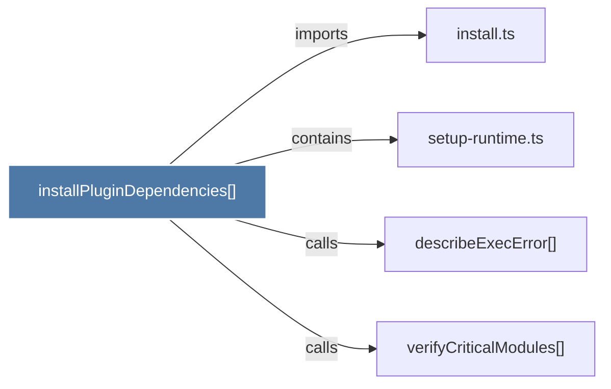

# installPluginDependencies()

> [!info] Properties
> **File Type**: code
> **Community**: [[_COMMUNITY_Community None|Community None]]
> **Degree**: 4

## Architecture Graph


## Outbound Connections
- [[describeExecError()]] - `calls` [EXTRACTED]
- [[install.ts]] - `imports` [EXTRACTED]
- [[setup-runtime.ts]] - `contains` [EXTRACTED]
- [[verifyCriticalModules()]] - `calls` [EXTRACTED]

## Inbound Dependencies
> [!abstract]- Files that link here
```dataview
LIST
FROM [[installPluginDependencies()]]
```

#graphify/code #graphify/EXTRACTED #community/Community_None