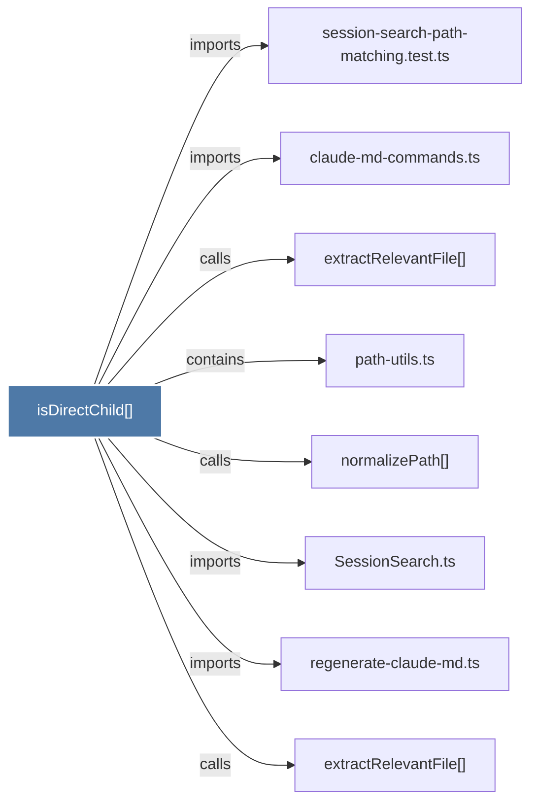

# isDirectChild()

> [!info] Properties
> **File Type**: code
> **Community**: [[_COMMUNITY_Community None|Community None]]
> **Degree**: 8

## Architecture Graph


## Outbound Connections
- [[SessionSearch.ts]] - `imports` [EXTRACTED]
- [[claude-md-commands.ts]] - `imports` [EXTRACTED]
- [[extractRelevantFile()]] - `calls` [INFERRED]
- [[extractRelevantFile()_1]] - `calls` [INFERRED]
- [[normalizePath()]] - `calls` [EXTRACTED]
- [[path-utils.ts]] - `contains` [EXTRACTED]
- [[regenerate-claude-md.ts]] - `imports` [EXTRACTED]
- [[session-search-path-matching.test.ts]] - `imports` [EXTRACTED]

## Inbound Dependencies
> [!abstract]- Files that link here
```dataview
LIST
FROM [[isDirectChild()]]
```

#graphify/code #graphify/EXTRACTED #community/Community_None