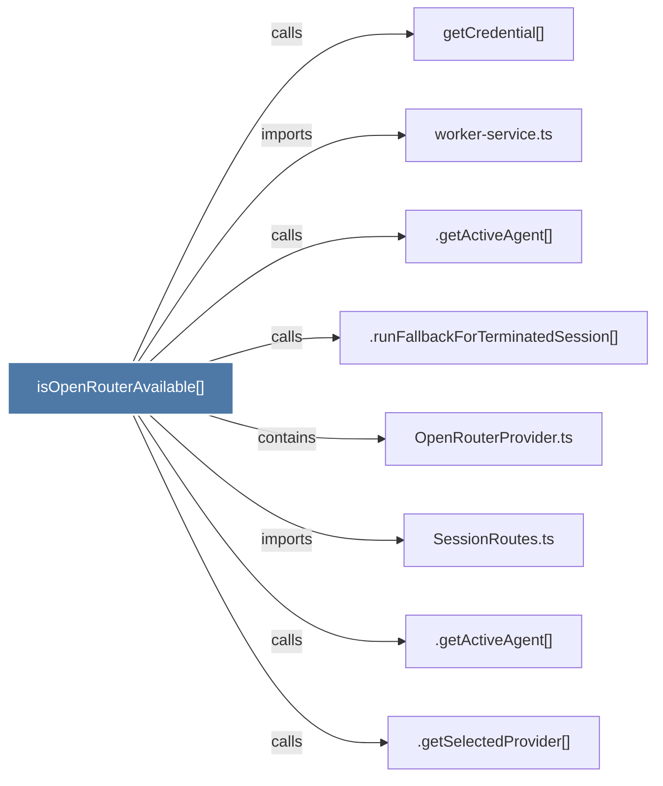

# isOpenRouterAvailable()

> [!info] Properties
> **File Type**: code
> **Community**: [[_COMMUNITY_Community None|Community None]]
> **Degree**: 8

## Architecture Graph


## Outbound Connections
- [[.getActiveAgent()]] - `calls` [INFERRED]
- [[.getActiveAgent()_1]] - `calls` [INFERRED]
- [[.getSelectedProvider()]] - `calls` [INFERRED]
- [[.runFallbackForTerminatedSession()]] - `calls` [INFERRED]
- [[OpenRouterProvider.ts]] - `contains` [EXTRACTED]
- [[SessionRoutes.ts]] - `imports` [EXTRACTED]
- [[getCredential()]] - `calls` [INFERRED]
- [[worker-service.ts]] - `imports` [EXTRACTED]

## Inbound Dependencies
> [!abstract]- Files that link here
```dataview
LIST
FROM [[isOpenRouterAvailable()]]
```

#graphify/code #graphify/INFERRED #community/Community_None