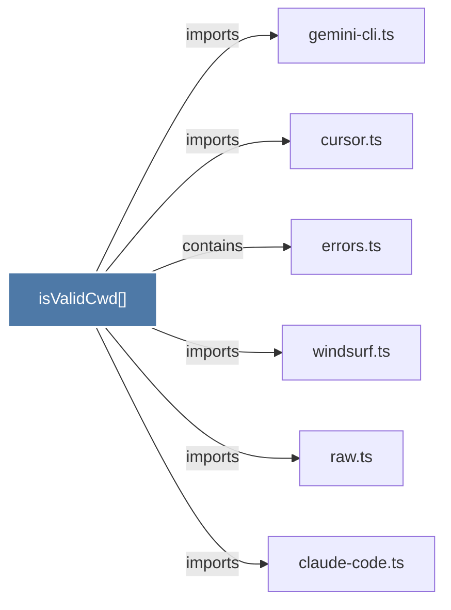

# isValidCwd()

> [!info] Properties
> **File Type**: code
> **Community**: [[_COMMUNITY_Community None|Community None]]
> **Degree**: 6

## Architecture Graph


## Outbound Connections
- [[claude-code.ts]] - `imports` [EXTRACTED]
- [[cursor.ts]] - `imports` [EXTRACTED]
- [[errors.ts]] - `contains` [EXTRACTED]
- [[gemini-cli.ts]] - `imports` [EXTRACTED]
- [[raw.ts]] - `imports` [EXTRACTED]
- [[windsurf.ts]] - `imports` [EXTRACTED]

## Inbound Dependencies
> [!abstract]- Files that link here
```dataview
LIST
FROM [[isValidCwd()]]
```

#graphify/code #graphify/EXTRACTED #community/Community_None