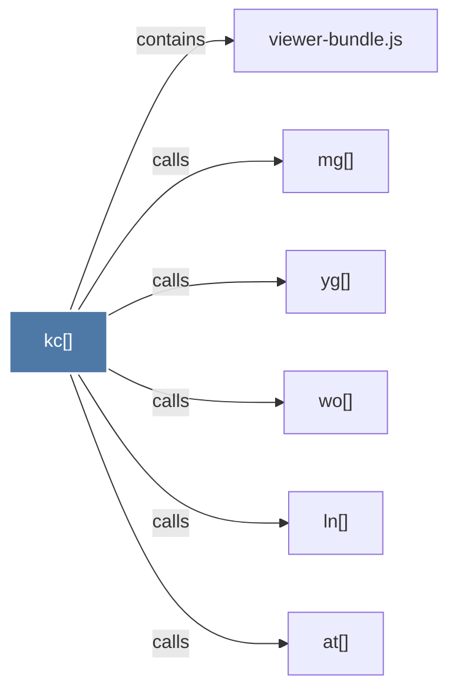

# kc()

> [!info] Properties
> **File Type**: code
> **Community**: [[_COMMUNITY_Community None|Community None]]
> **Degree**: 6

## Architecture Graph


## Outbound Connections
- [[at()]] - `calls` [EXTRACTED]
- [[ln()]] - `calls` [EXTRACTED]
- [[mg()]] - `calls` [EXTRACTED]
- [[viewer-bundle.js]] - `contains` [EXTRACTED]
- [[wo()]] - `calls` [EXTRACTED]
- [[yg()]] - `calls` [EXTRACTED]

## Inbound Dependencies
> [!abstract]- Files that link here
```dataview
LIST
FROM [[kc()]]
```

#graphify/code #graphify/EXTRACTED #community/Community_None