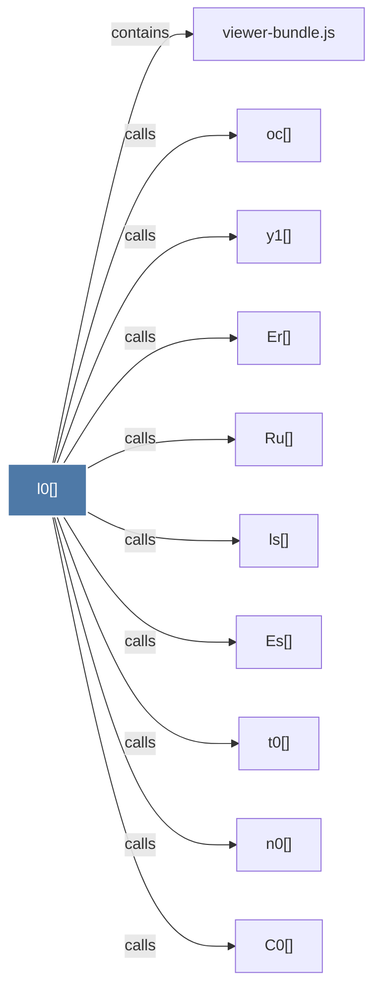

# l0()

> [!info] Properties
> **File Type**: code
> **Community**: [[_COMMUNITY_Community None|Community None]]
> **Degree**: 10

## Architecture Graph


## Outbound Connections
- [[C0()]] - `calls` [EXTRACTED]
- [[Er()]] - `calls` [EXTRACTED]
- [[Es()]] - `calls` [EXTRACTED]
- [[Ru()]] - `calls` [EXTRACTED]
- [[ls()]] - `calls` [EXTRACTED]
- [[n0()]] - `calls` [EXTRACTED]
- [[oc()]] - `calls` [EXTRACTED]
- [[t0()]] - `calls` [EXTRACTED]
- [[viewer-bundle.js]] - `contains` [EXTRACTED]
- [[y1()]] - `calls` [EXTRACTED]

## Inbound Dependencies
> [!abstract]- Files that link here
```dataview
LIST
FROM [[l0()]]
```

#graphify/code #graphify/EXTRACTED #community/Community_None