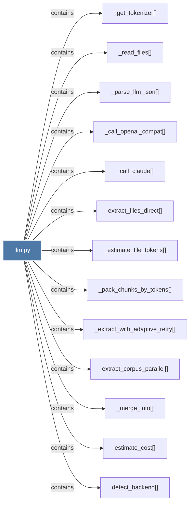

# llm.py

> [!info] Properties
> **File Type**: code
> **Community**: [[_COMMUNITY_Community None|Community None]]
> **Degree**: 13

## Architecture Graph


## Outbound Connections
- [[_call_claude()]] - `contains` [EXTRACTED]
- [[_call_openai_compat()]] - `contains` [EXTRACTED]
- [[_estimate_file_tokens()]] - `contains` [EXTRACTED]
- [[_extract_with_adaptive_retry()]] - `contains` [EXTRACTED]
- [[_get_tokenizer()]] - `contains` [EXTRACTED]
- [[_merge_into()]] - `contains` [EXTRACTED]
- [[_pack_chunks_by_tokens()]] - `contains` [EXTRACTED]
- [[_parse_llm_json()]] - `contains` [EXTRACTED]
- [[_read_files()]] - `contains` [EXTRACTED]
- [[detect_backend()]] - `contains` [EXTRACTED]
- [[estimate_cost()]] - `contains` [EXTRACTED]
- [[extract_corpus_parallel()]] - `contains` [EXTRACTED]
- [[extract_files_direct()]] - `contains` [EXTRACTED]

## Inbound Dependencies
> [!abstract]- Files that link here
```dataview
LIST
FROM [[llm.py]]
```

#graphify/code #graphify/EXTRACTED #community/Community_None