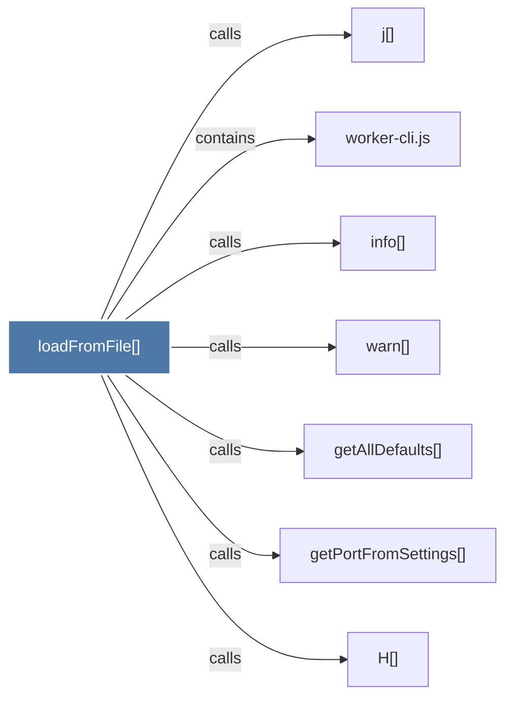

# loadFromFile()

> [!info] Properties
> **File Type**: code
> **Community**: [[_COMMUNITY_Community None|Community None]]
> **Degree**: 7

## Architecture Graph


## Outbound Connections
- [[H()]] - `calls` [EXTRACTED]
- [[getAllDefaults()]] - `calls` [EXTRACTED]
- [[getPortFromSettings()]] - `calls` [EXTRACTED]
- [[info()]] - `calls` [EXTRACTED]
- [[j()]] - `calls` [INFERRED]
- [[warn()]] - `calls` [EXTRACTED]
- [[worker-cli.js]] - `contains` [EXTRACTED]

## Inbound Dependencies
> [!abstract]- Files that link here
```dataview
LIST
FROM [[loadFromFile()]]
```

#graphify/code #graphify/EXTRACTED #community/Community_None