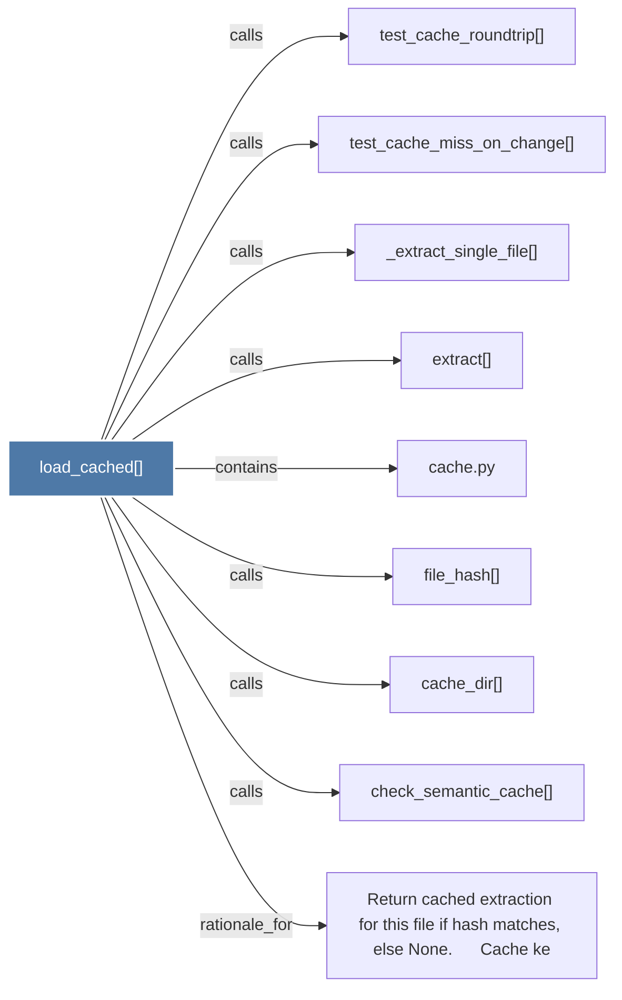

# load_cached()

> [!info] Properties
> **File Type**: code
> **Community**: [[_COMMUNITY_Community None|Community None]]
> **Degree**: 9

## Architecture Graph


## Outbound Connections
- [[Return cached extraction for this file if hash matches, else None.      Cache ke]] - `rationale_for` [EXTRACTED]
- [[_extract_single_file()]] - `calls` [INFERRED]
- [[cache.py]] - `contains` [EXTRACTED]
- [[cache_dir()]] - `calls` [EXTRACTED]
- [[check_semantic_cache()]] - `calls` [EXTRACTED]
- [[extract()]] - `calls` [INFERRED]
- [[file_hash()]] - `calls` [EXTRACTED]
- [[test_cache_miss_on_change()]] - `calls` [INFERRED]
- [[test_cache_roundtrip()]] - `calls` [INFERRED]

## Inbound Dependencies
> [!abstract]- Files that link here
```dataview
LIST
FROM [[load_cached()]]
```

#graphify/code #graphify/EXTRACTED #community/Community_None