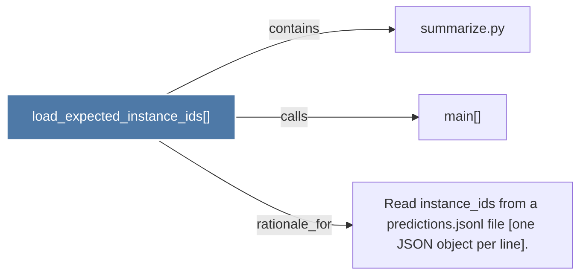

# load_expected_instance_ids()

> [!info] Properties
> **File Type**: code
> **Community**: [[_COMMUNITY_Community None|Community None]]
> **Degree**: 3

## Architecture Graph


## Outbound Connections
- [[Read instance_ids from a predictions.jsonl file (one JSON object per line).]] - `rationale_for` [EXTRACTED]
- [[main()_26]] - `calls` [EXTRACTED]
- [[summarize.py]] - `contains` [EXTRACTED]

## Inbound Dependencies
> [!abstract]- Files that link here
```dataview
LIST
FROM [[load_expected_instance_ids()]]
```

#graphify/code #graphify/EXTRACTED #community/Community_None