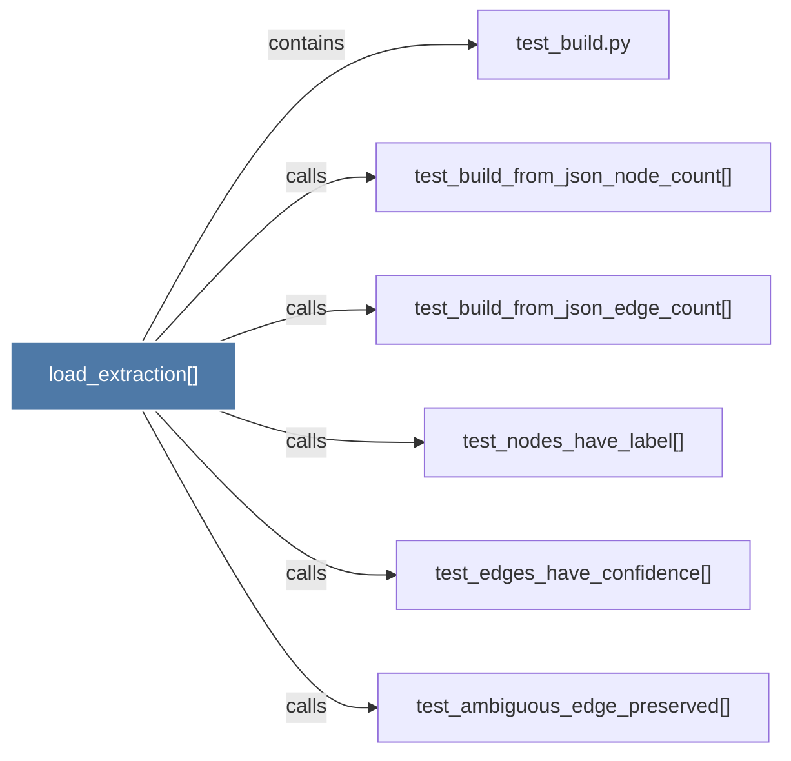

# load_extraction()

> [!info] Properties
> **File Type**: code
> **Community**: [[_COMMUNITY_Community None|Community None]]
> **Degree**: 6

## Architecture Graph


## Outbound Connections
- [[test_ambiguous_edge_preserved()]] - `calls` [EXTRACTED]
- [[test_build.py]] - `contains` [EXTRACTED]
- [[test_build_from_json_edge_count()]] - `calls` [EXTRACTED]
- [[test_build_from_json_node_count()]] - `calls` [EXTRACTED]
- [[test_edges_have_confidence()]] - `calls` [EXTRACTED]
- [[test_nodes_have_label()]] - `calls` [EXTRACTED]

## Inbound Dependencies
> [!abstract]- Files that link here
```dataview
LIST
FROM [[load_extraction()]]
```

#graphify/code #graphify/EXTRACTED #community/Community_None