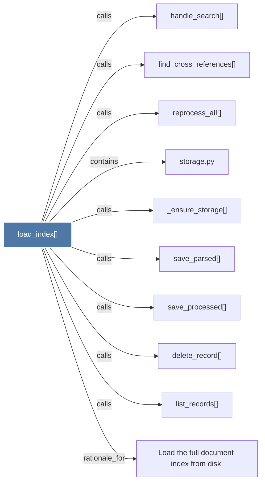

# load_index()

> [!info] Properties
> **File Type**: code
> **Community**: [[_COMMUNITY_Community None|Community None]]
> **Degree**: 10

## Architecture Graph


## Outbound Connections
- [[Load the full document index from disk.]] - `rationale_for` [EXTRACTED]
- [[_ensure_storage()]] - `calls` [EXTRACTED]
- [[delete_record()]] - `calls` [EXTRACTED]
- [[find_cross_references()]] - `calls` [INFERRED]
- [[handle_search()]] - `calls` [INFERRED]
- [[list_records()]] - `calls` [EXTRACTED]
- [[reprocess_all()]] - `calls` [INFERRED]
- [[save_parsed()]] - `calls` [EXTRACTED]
- [[save_processed()]] - `calls` [EXTRACTED]
- [[storage.py]] - `contains` [EXTRACTED]

## Inbound Dependencies
> [!abstract]- Files that link here
```dataview
LIST
FROM [[load_index()]]
```

#graphify/code #graphify/EXTRACTED #community/Community_None