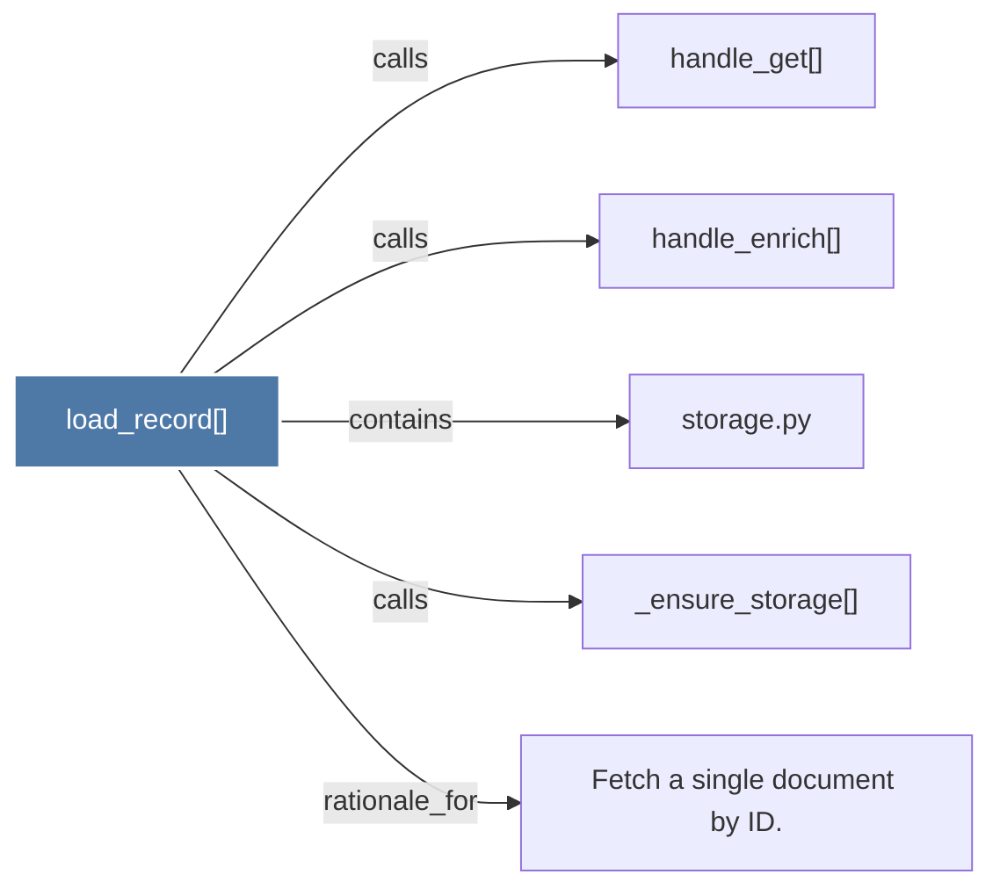

# load_record()

> [!info] Properties
> **File Type**: code
> **Community**: [[_COMMUNITY_Community None|Community None]]
> **Degree**: 5

## Architecture Graph


## Outbound Connections
- [[Fetch a single document by ID.]] - `rationale_for` [EXTRACTED]
- [[_ensure_storage()]] - `calls` [EXTRACTED]
- [[handle_enrich()]] - `calls` [INFERRED]
- [[handle_get()]] - `calls` [INFERRED]
- [[storage.py]] - `contains` [EXTRACTED]

## Inbound Dependencies
> [!abstract]- Files that link here
```dataview
LIST
FROM [[load_record()]]
```

#graphify/code #graphify/EXTRACTED #community/Community_None