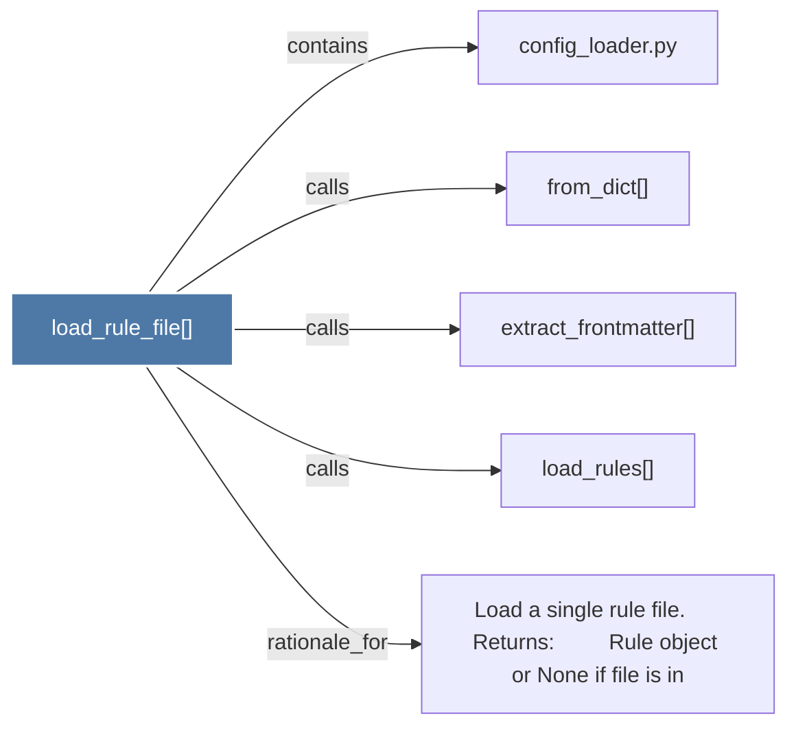

# load_rule_file()

> [!info] Properties
> **File Type**: code
> **Community**: [[_COMMUNITY_Community None|Community None]]
> **Degree**: 5

## Architecture Graph


## Outbound Connections
- [[Load a single rule file.      Returns         Rule object or None if file is in]] - `rationale_for` [EXTRACTED]
- [[config_loader.py]] - `contains` [EXTRACTED]
- [[extract_frontmatter()]] - `calls` [EXTRACTED]
- [[from_dict()]] - `calls` [EXTRACTED]
- [[load_rules()]] - `calls` [EXTRACTED]

## Inbound Dependencies
> [!abstract]- Files that link here
```dataview
LIST
FROM [[load_rule_file()]]
```

#graphify/code #graphify/EXTRACTED #community/Community_None