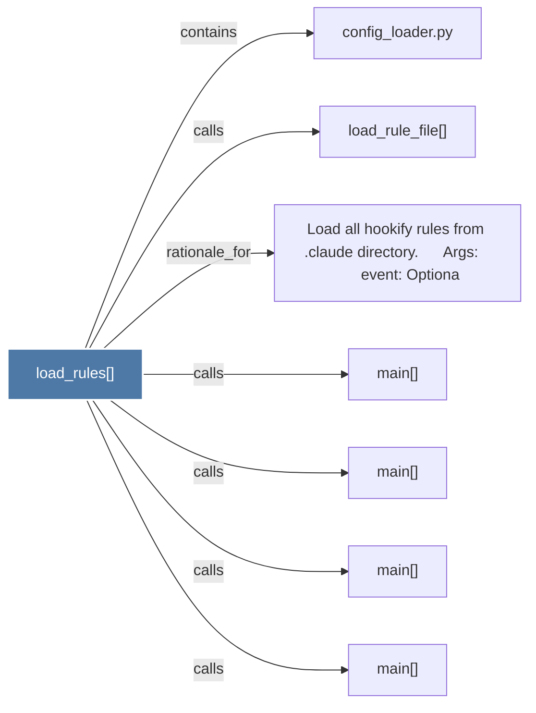

# load_rules()

> [!info] Properties
> **File Type**: code
> **Community**: [[_COMMUNITY_Community None|Community None]]
> **Degree**: 7

## Architecture Graph


## Outbound Connections
- [[Load all hookify rules from .claude directory.      Args         event Optiona]] - `rationale_for` [EXTRACTED]
- [[config_loader.py]] - `contains` [EXTRACTED]
- [[load_rule_file()]] - `calls` [EXTRACTED]
- [[main()_4]] - `calls` [INFERRED]
- [[main()_5]] - `calls` [INFERRED]
- [[main()_6]] - `calls` [INFERRED]
- [[main()_7]] - `calls` [INFERRED]

## Inbound Dependencies
> [!abstract]- Files that link here
```dataview
LIST
FROM [[load_rules()]]
```

#graphify/code #graphify/INFERRED #community/Community_None