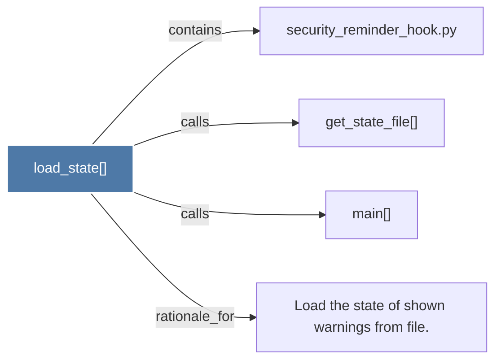

# load_state()

> [!info] Properties
> **File Type**: code
> **Community**: [[_COMMUNITY_Community None|Community None]]
> **Degree**: 4

## Architecture Graph


## Outbound Connections
- [[Load the state of shown warnings from file.]] - `rationale_for` [EXTRACTED]
- [[get_state_file()]] - `calls` [EXTRACTED]
- [[main()_8]] - `calls` [EXTRACTED]
- [[security_reminder_hook.py]] - `contains` [EXTRACTED]

## Inbound Dependencies
> [!abstract]- Files that link here
```dataview
LIST
FROM [[load_state()]]
```

#graphify/code #graphify/EXTRACTED #community/Community_None