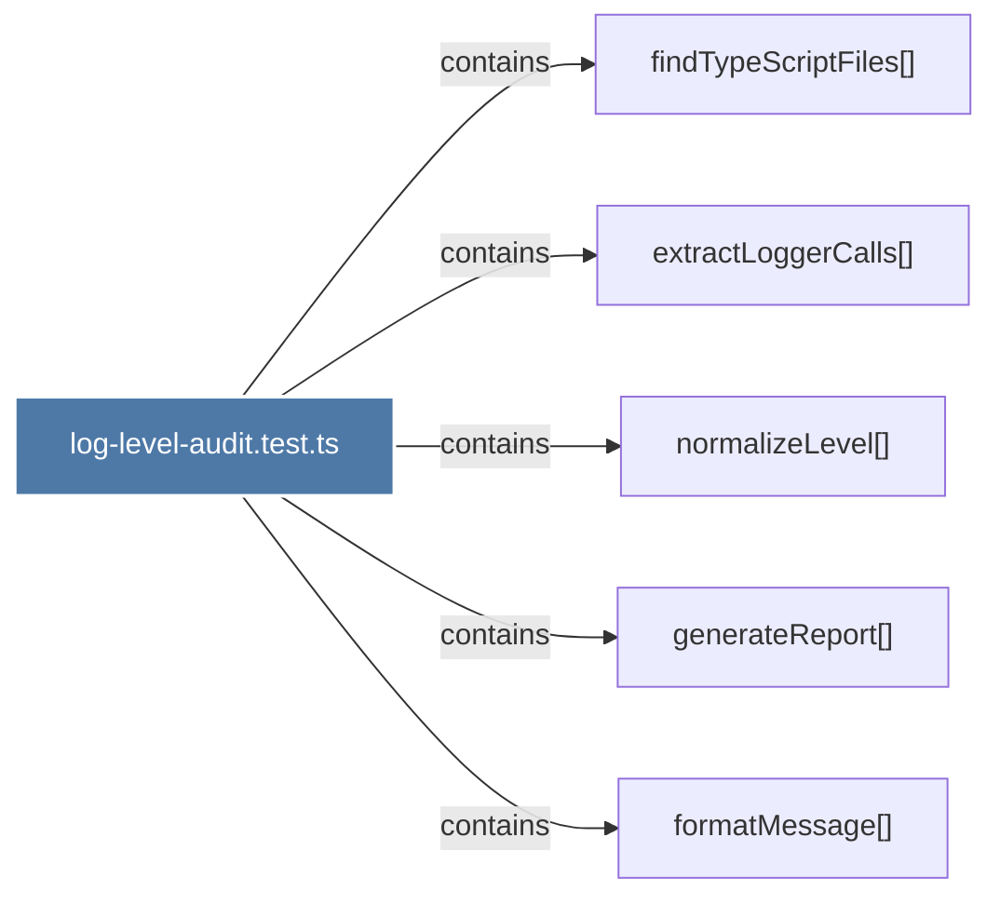

# log-level-audit.test.ts

> [!info] Properties
> **File Type**: code
> **Community**: [[_COMMUNITY_Community None|Community None]]
> **Degree**: 5

## Architecture Graph


## Outbound Connections
- [[extractLoggerCalls()]] - `contains` [EXTRACTED]
- [[findTypeScriptFiles()_1]] - `contains` [EXTRACTED]
- [[formatMessage()]] - `contains` [EXTRACTED]
- [[generateReport()]] - `contains` [EXTRACTED]
- [[normalizeLevel()]] - `contains` [EXTRACTED]

## Inbound Dependencies
> [!abstract]- Files that link here
```dataview
LIST
FROM [[log-level-audit.test.ts]]
```

#graphify/code #graphify/EXTRACTED #community/Community_None