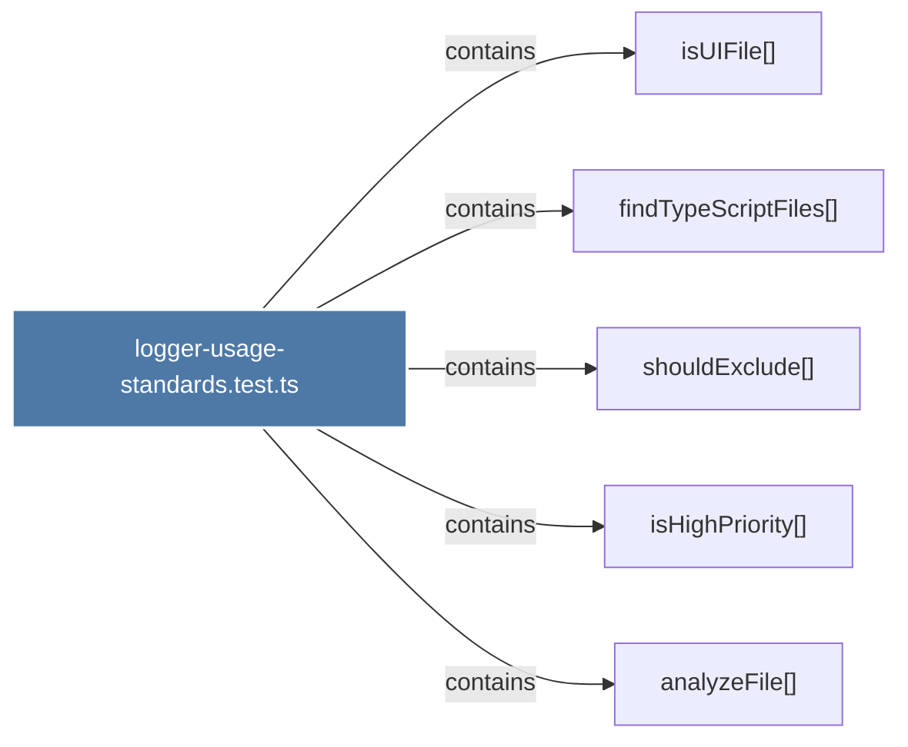

# logger-usage-standards.test.ts

> [!info] Properties
> **File Type**: code
> **Community**: [[_COMMUNITY_Community None|Community None]]
> **Degree**: 5

## Architecture Graph


## Outbound Connections
- [[analyzeFile()]] - `contains` [EXTRACTED]
- [[findTypeScriptFiles()]] - `contains` [EXTRACTED]
- [[isHighPriority()]] - `contains` [EXTRACTED]
- [[isUIFile()]] - `contains` [EXTRACTED]
- [[shouldExclude()]] - `contains` [EXTRACTED]

## Inbound Dependencies
> [!abstract]- Files that link here
```dataview
LIST
FROM [[logger-usage-standards.test.ts]]
```

#graphify/code #graphify/EXTRACTED #community/Community_None