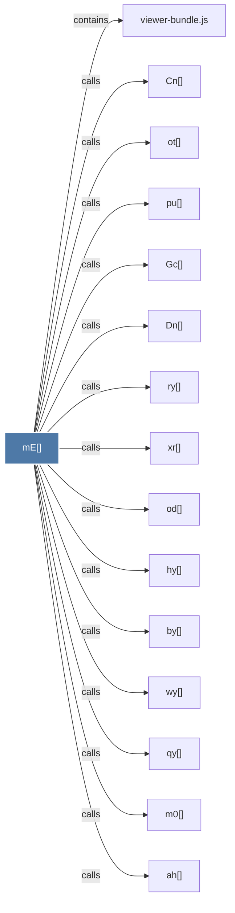

# mE()

> [!info] Properties
> **File Type**: code
> **Community**: [[_COMMUNITY_Community None|Community None]]
> **Degree**: 19

## Architecture Graph


## Outbound Connections
- [[Cn()]] - `calls` [EXTRACTED]
- [[Dn()]] - `calls` [EXTRACTED]
- [[Gc()]] - `calls` [EXTRACTED]
- [[Yr()]] - `calls` [EXTRACTED]
- [[ah()]] - `calls` [EXTRACTED]
- [[by()]] - `calls` [EXTRACTED]
- [[hy()]] - `calls` [EXTRACTED]
- [[ih()]] - `calls` [EXTRACTED]
- [[jr()]] - `calls` [EXTRACTED]
- [[m0()]] - `calls` [EXTRACTED]
- [[od()]] - `calls` [EXTRACTED]
- [[oh()]] - `calls` [EXTRACTED]
- [[ot()]] - `calls` [EXTRACTED]
- [[pu()]] - `calls` [EXTRACTED]
- [[qy()]] - `calls` [EXTRACTED]
- [[ry()]] - `calls` [EXTRACTED]
- [[viewer-bundle.js]] - `contains` [EXTRACTED]
- [[wy()]] - `calls` [EXTRACTED]
- [[xr()]] - `calls` [EXTRACTED]

## Inbound Dependencies
> [!abstract]- Files that link here
```dataview
LIST
FROM [[mE()]]
```

#graphify/code #graphify/EXTRACTED #community/Community_None