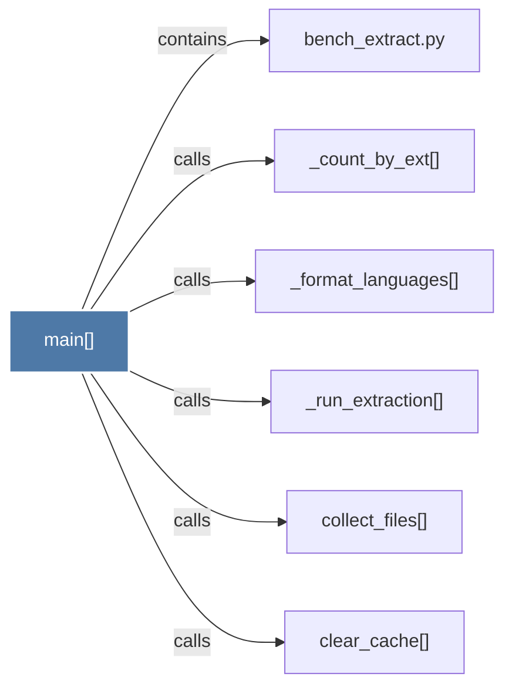

# main()

> [!info] Properties
> **File Type**: code
> **Community**: [[_COMMUNITY_Community None|Community None]]
> **Degree**: 6

## Architecture Graph


## Outbound Connections
- [[_count_by_ext()]] - `calls` [EXTRACTED]
- [[_format_languages()]] - `calls` [EXTRACTED]
- [[_run_extraction()]] - `calls` [EXTRACTED]
- [[bench_extract.py]] - `contains` [EXTRACTED]
- [[clear_cache()]] - `calls` [INFERRED]
- [[collect_files()]] - `calls` [INFERRED]

## Inbound Dependencies
> [!abstract]- Files that link here
```dataview
LIST
FROM [[main()]]
```

#graphify/code #graphify/EXTRACTED #community/Community_None