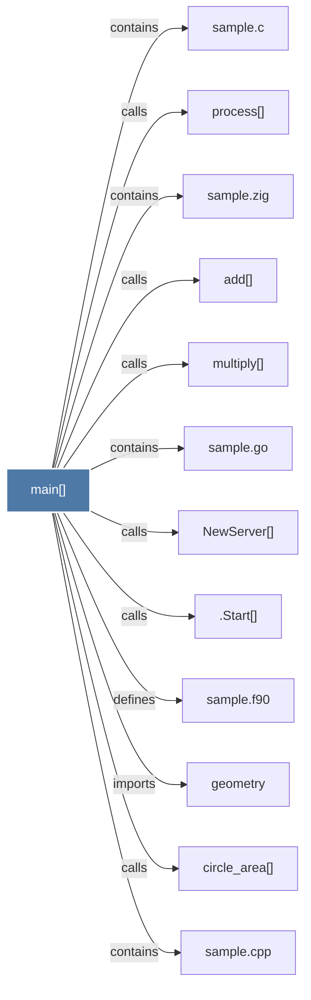

# main()

> [!info] Properties
> **File Type**: code
> **Community**: [[_COMMUNITY_Community None|Community None]]
> **Degree**: 12

## Architecture Graph


## Outbound Connections
- [[.Start()]] - `calls` [EXTRACTED]
- [[NewServer()]] - `calls` [EXTRACTED]
- [[add()]] - `calls` [EXTRACTED]
- [[circle_area()]] - `calls` [EXTRACTED]
- [[geometry_1]] - `imports` [EXTRACTED]
- [[multiply()]] - `calls` [EXTRACTED]
- [[process()]] - `calls` [EXTRACTED]
- [[sample.c]] - `contains` [EXTRACTED]
- [[sample.cpp]] - `contains` [EXTRACTED]
- [[sample.f90]] - `defines` [EXTRACTED]
- [[sample.go]] - `contains` [EXTRACTED]
- [[sample.zig]] - `contains` [EXTRACTED]

## Inbound Dependencies
> [!abstract]- Files that link here
```dataview
LIST
FROM [[main()_1]]
```

#graphify/code #graphify/EXTRACTED #community/Community_None