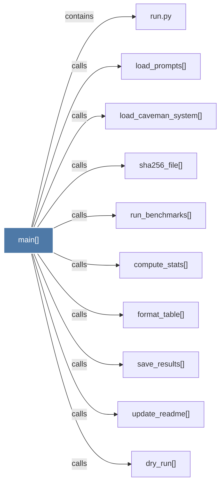

# main()

> [!info] Properties
> **File Type**: code
> **Community**: [[_COMMUNITY_Community None|Community None]]
> **Degree**: 10

## Architecture Graph


## Outbound Connections
- [[compute_stats()]] - `calls` [EXTRACTED]
- [[dry_run()]] - `calls` [EXTRACTED]
- [[format_table()]] - `calls` [EXTRACTED]
- [[load_caveman_system()]] - `calls` [EXTRACTED]
- [[load_prompts()]] - `calls` [EXTRACTED]
- [[run.py]] - `contains` [EXTRACTED]
- [[run_benchmarks()]] - `calls` [EXTRACTED]
- [[save_results()]] - `calls` [EXTRACTED]
- [[sha256_file()]] - `calls` [EXTRACTED]
- [[update_readme()]] - `calls` [EXTRACTED]

## Inbound Dependencies
> [!abstract]- Files that link here
```dataview
LIST
FROM [[main()_13]]
```

#graphify/code #graphify/EXTRACTED #community/Community_None