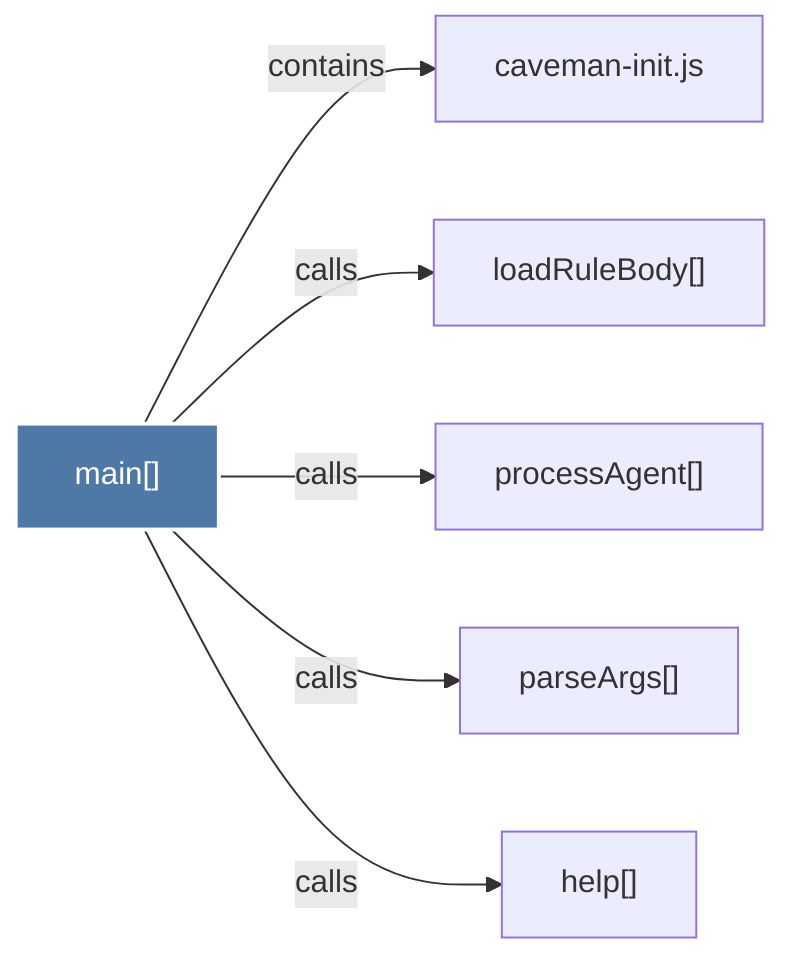

# main()

> [!info] Properties
> **File Type**: code
> **Community**: [[_COMMUNITY_Community None|Community None]]
> **Degree**: 5

## Architecture Graph


## Outbound Connections
- [[caveman-init.js]] - `contains` [EXTRACTED]
- [[help()]] - `calls` [EXTRACTED]
- [[loadRuleBody()]] - `calls` [EXTRACTED]
- [[parseArgs()]] - `calls` [EXTRACTED]
- [[processAgent()]] - `calls` [EXTRACTED]

## Inbound Dependencies
> [!abstract]- Files that link here
```dataview
LIST
FROM [[main()_17]]
```

#graphify/code #graphify/EXTRACTED #community/Community_None