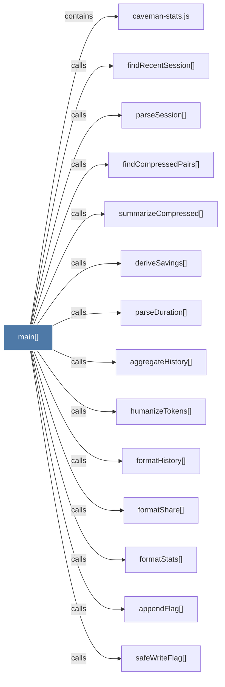

# main()

> [!info] Properties
> **File Type**: code
> **Community**: [[_COMMUNITY_Community None|Community None]]
> **Degree**: 14

## Architecture Graph


## Outbound Connections
- [[aggregateHistory()]] - `calls` [EXTRACTED]
- [[appendFlag()]] - `calls` [INFERRED]
- [[caveman-stats.js]] - `contains` [EXTRACTED]
- [[deriveSavings()]] - `calls` [EXTRACTED]
- [[findCompressedPairs()]] - `calls` [EXTRACTED]
- [[findRecentSession()]] - `calls` [EXTRACTED]
- [[formatHistory()]] - `calls` [EXTRACTED]
- [[formatShare()]] - `calls` [EXTRACTED]
- [[formatStats()]] - `calls` [EXTRACTED]
- [[humanizeTokens()]] - `calls` [EXTRACTED]
- [[parseDuration()]] - `calls` [EXTRACTED]
- [[parseSession()]] - `calls` [EXTRACTED]
- [[safeWriteFlag()]] - `calls` [INFERRED]
- [[summarizeCompressed()]] - `calls` [EXTRACTED]

## Inbound Dependencies
> [!abstract]- Files that link here
```dataview
LIST
FROM [[main()_18]]
```

#graphify/code #graphify/EXTRACTED #community/Community_None