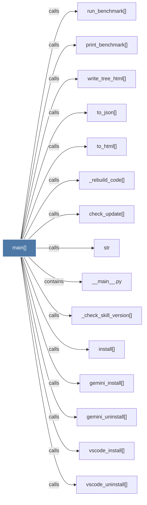

# main()

> [!info] Properties
> **File Type**: code
> **Community**: [[_COMMUNITY_Community None|Community None]]
> **Degree**: 32

## Architecture Graph


## Outbound Connections
- [[.list()]] - `calls` [INFERRED]
- [[__main__.py]] - `contains` [EXTRACTED]
- [[_agents_install()_1]] - `calls` [EXTRACTED]
- [[_agents_uninstall()_1]] - `calls` [EXTRACTED]
- [[_antigravity_install()]] - `calls` [EXTRACTED]
- [[_antigravity_uninstall()]] - `calls` [EXTRACTED]
- [[_check_skill_version()]] - `calls` [EXTRACTED]
- [[_clone_repo()]] - `calls` [EXTRACTED]
- [[_cursor_install()]] - `calls` [EXTRACTED]
- [[_cursor_uninstall()]] - `calls` [EXTRACTED]
- [[_find_node()]] - `calls` [INFERRED]
- [[_kiro_install()]] - `calls` [EXTRACTED]
- [[_kiro_uninstall()]] - `calls` [EXTRACTED]
- [[_load_graph()]] - `calls` [INFERRED]
- [[_query_graph_text()]] - `calls` [INFERRED]
- [[_rebuild_code()]] - `calls` [INFERRED]
- [[_score_nodes()]] - `calls` [INFERRED]
- [[_uninstall_codex_hook()]] - `calls` [EXTRACTED]
- [[check_update()]] - `calls` [INFERRED]
- [[claude_install()]] - `calls` [EXTRACTED]
- [[claude_uninstall()]] - `calls` [EXTRACTED]
- [[gemini_install()]] - `calls` [EXTRACTED]
- [[gemini_uninstall()]] - `calls` [EXTRACTED]
- [[install()_1]] - `calls` [EXTRACTED]
- [[print_benchmark()]] - `calls` [INFERRED]
- [[run_benchmark()]] - `calls` [INFERRED]
- [[str]] - `calls` [INFERRED]
- [[to_html()]] - `calls` [INFERRED]
- [[to_json()]] - `calls` [INFERRED]
- [[vscode_install()]] - `calls` [EXTRACTED]
- [[vscode_uninstall()]] - `calls` [EXTRACTED]
- [[write_tree_html()]] - `calls` [INFERRED]

## Inbound Dependencies
> [!abstract]- Files that link here
```dataview
LIST
FROM [[main()_2]]
```

#graphify/code #graphify/EXTRACTED #community/Community_None