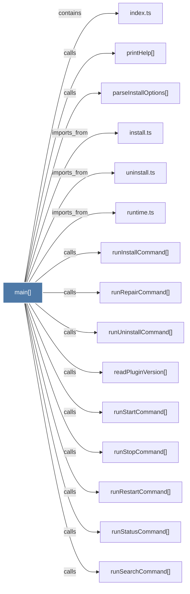

# main()

> [!info] Properties
> **File Type**: code
> **Community**: [[_COMMUNITY_Community None|Community None]]
> **Degree**: 18

## Architecture Graph


## Outbound Connections
- [[index.ts_3]] - `contains` [EXTRACTED]
- [[install.ts]] - `imports_from` [EXTRACTED]
- [[parseInstallOptions()]] - `calls` [EXTRACTED]
- [[printHelp()]] - `calls` [EXTRACTED]
- [[readPluginVersion()]] - `calls` [INFERRED]
- [[runAdoptCommand()]] - `calls` [INFERRED]
- [[runCleanupCommand()]] - `calls` [INFERRED]
- [[runInstallCommand()]] - `calls` [INFERRED]
- [[runRepairCommand()]] - `calls` [INFERRED]
- [[runRestartCommand()]] - `calls` [INFERRED]
- [[runSearchCommand()]] - `calls` [INFERRED]
- [[runStartCommand()]] - `calls` [INFERRED]
- [[runStatusCommand()]] - `calls` [INFERRED]
- [[runStopCommand()]] - `calls` [INFERRED]
- [[runTranscriptWatchCommand()]] - `calls` [INFERRED]
- [[runUninstallCommand()]] - `calls` [INFERRED]
- [[runtime.ts]] - `imports_from` [EXTRACTED]
- [[uninstall.ts]] - `imports_from` [EXTRACTED]

## Inbound Dependencies
> [!abstract]- Files that link here
```dataview
LIST
FROM [[main()_21]]
```

#graphify/code #graphify/INFERRED #community/Community_None