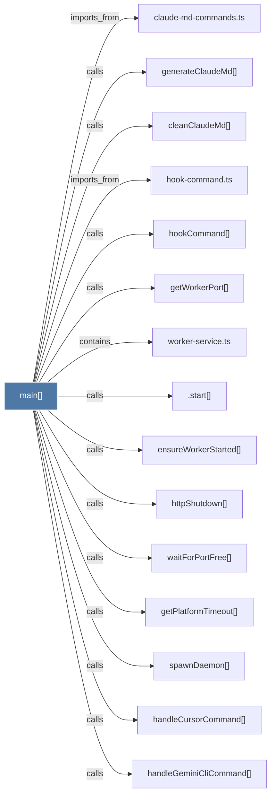

# main()

> [!info] Properties
> **File Type**: code
> **Community**: [[_COMMUNITY_Community None|Community None]]
> **Degree**: 18

## Architecture Graph


## Outbound Connections
- [[.start()]] - `calls` [EXTRACTED]
- [[adoptMergedWorktrees()]] - `calls` [INFERRED]
- [[claude-md-commands.ts]] - `imports_from` [EXTRACTED]
- [[cleanClaudeMd()]] - `calls` [INFERRED]
- [[ensureWorkerStarted()_1]] - `calls` [EXTRACTED]
- [[generateClaudeMd()]] - `calls` [INFERRED]
- [[getPlatformTimeout()]] - `calls` [INFERRED]
- [[getWorkerPort()]] - `calls` [INFERRED]
- [[handleCursorCommand()]] - `calls` [INFERRED]
- [[handleGeminiCliCommand()]] - `calls` [INFERRED]
- [[hook-command.ts]] - `imports_from` [EXTRACTED]
- [[hookCommand()]] - `calls` [INFERRED]
- [[httpShutdown()]] - `calls` [INFERRED]
- [[runOneTimeV12_4_3Cleanup()]] - `calls` [INFERRED]
- [[spawnDaemon()]] - `calls` [INFERRED]
- [[verifyPidFileOwnership()]] - `calls` [INFERRED]
- [[waitForPortFree()]] - `calls` [INFERRED]
- [[worker-service.ts]] - `contains` [EXTRACTED]

## Inbound Dependencies
> [!abstract]- Files that link here
```dataview
LIST
FROM [[main()_22]]
```

#graphify/code #graphify/INFERRED #community/Community_None