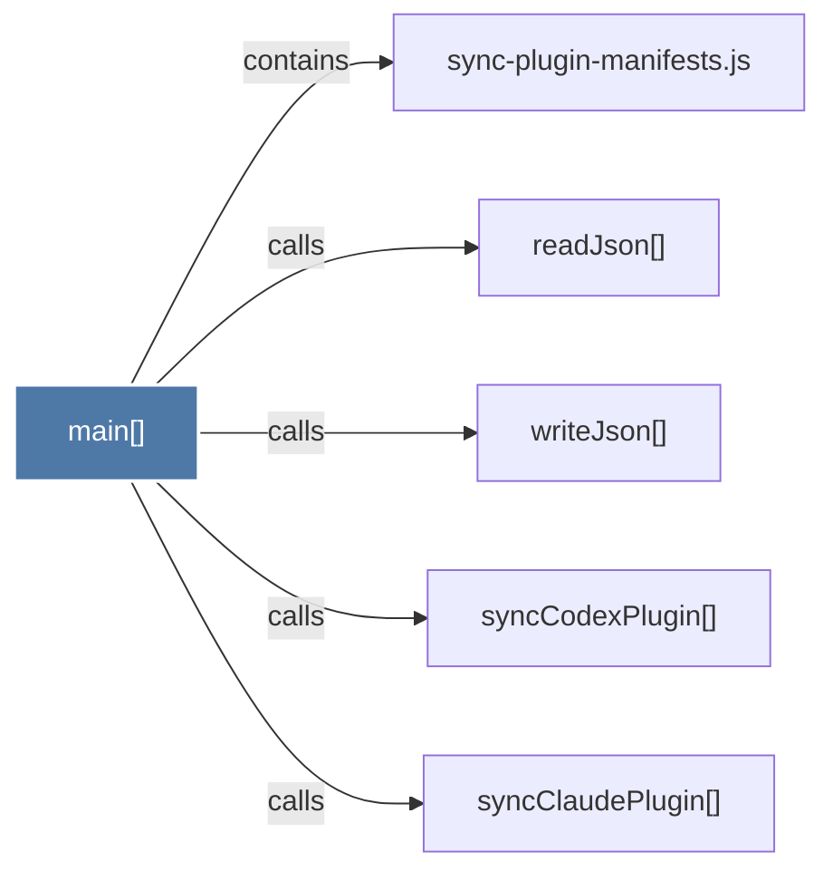

# main()

> [!info] Properties
> **File Type**: code
> **Community**: [[_COMMUNITY_Community None|Community None]]
> **Degree**: 5

## Architecture Graph


## Outbound Connections
- [[readJson()]] - `calls` [EXTRACTED]
- [[sync-plugin-manifests.js]] - `contains` [EXTRACTED]
- [[syncClaudePlugin()]] - `calls` [EXTRACTED]
- [[syncCodexPlugin()]] - `calls` [EXTRACTED]
- [[writeJson()]] - `calls` [EXTRACTED]

## Inbound Dependencies
> [!abstract]- Files that link here
```dataview
LIST
FROM [[main()_34]]
```

#graphify/code #graphify/EXTRACTED #community/Community_None