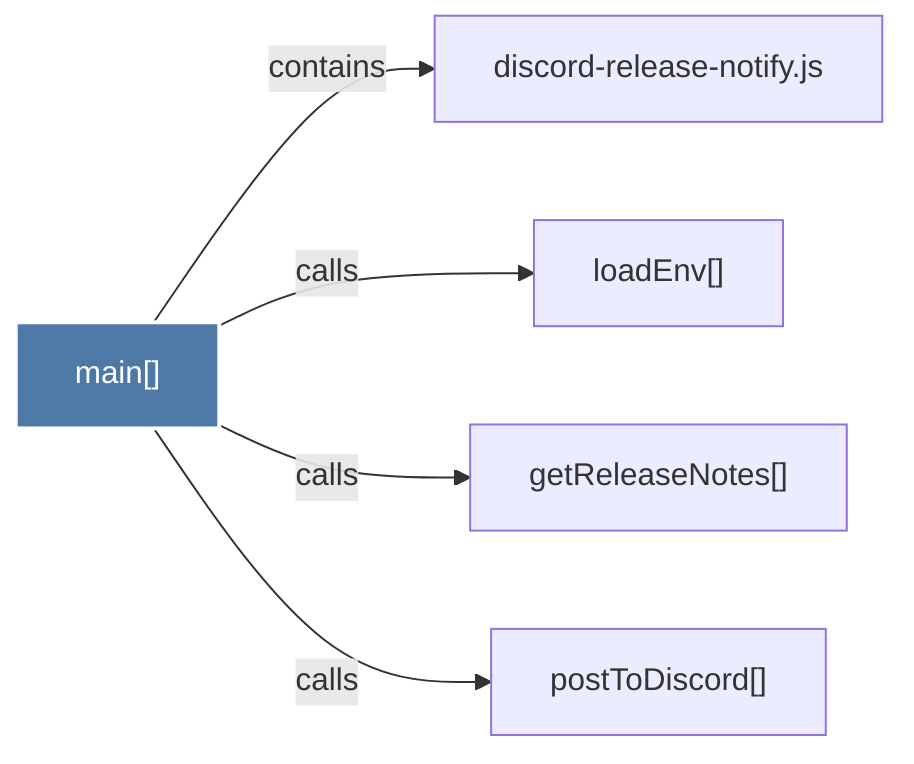

# main()

> [!info] Properties
> **File Type**: code
> **Community**: [[_COMMUNITY_Community None|Community None]]
> **Degree**: 4

## Architecture Graph


## Outbound Connections
- [[discord-release-notify.js]] - `contains` [EXTRACTED]
- [[getReleaseNotes()]] - `calls` [EXTRACTED]
- [[loadEnv()]] - `calls` [EXTRACTED]
- [[postToDiscord()]] - `calls` [EXTRACTED]

## Inbound Dependencies
> [!abstract]- Files that link here
```dataview
LIST
FROM [[main()_38]]
```

#graphify/code #graphify/EXTRACTED #community/Community_None