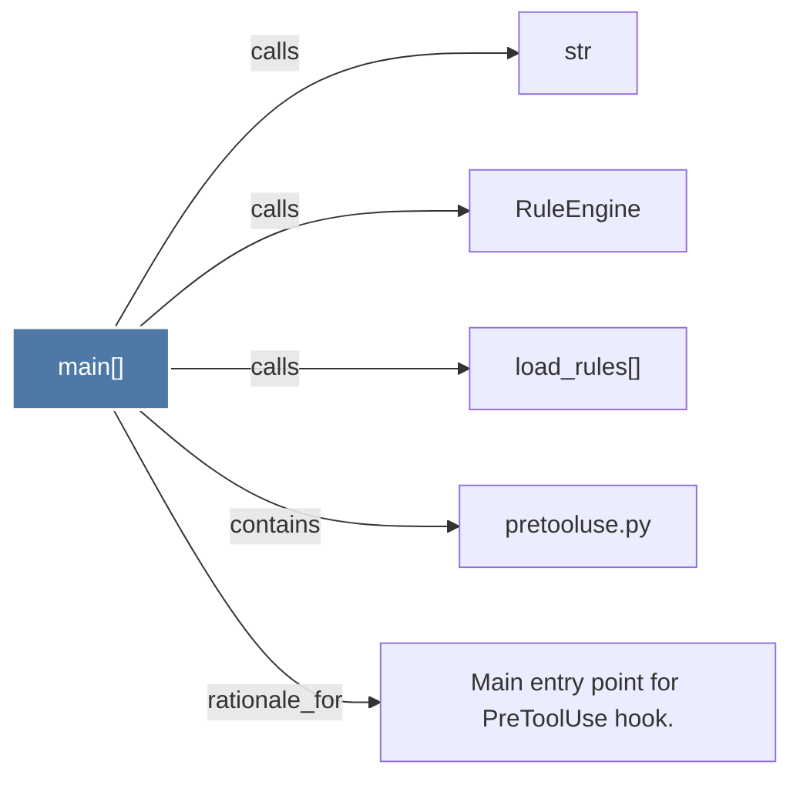

# main()

> [!info] Properties
> **File Type**: code
> **Community**: [[_COMMUNITY_Community None|Community None]]
> **Degree**: 5

## Architecture Graph


## Outbound Connections
- [[Main entry point for PreToolUse hook.]] - `rationale_for` [EXTRACTED]
- [[RuleEngine]] - `calls` [INFERRED]
- [[load_rules()]] - `calls` [INFERRED]
- [[pretooluse.py]] - `contains` [EXTRACTED]
- [[str]] - `calls` [INFERRED]

## Inbound Dependencies
> [!abstract]- Files that link here
```dataview
LIST
FROM [[main()_4]]
```

#graphify/code #graphify/INFERRED #community/Community_None