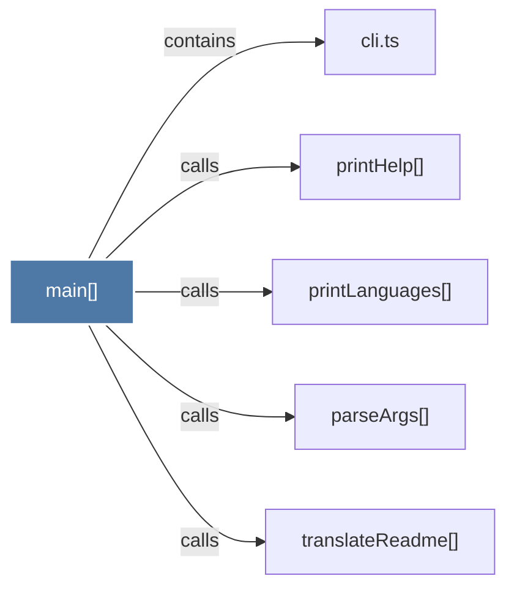

# main()

> [!info] Properties
> **File Type**: code
> **Community**: [[_COMMUNITY_Community None|Community None]]
> **Degree**: 5

## Architecture Graph


## Outbound Connections
- [[cli.ts_2]] - `contains` [EXTRACTED]
- [[parseArgs()_3]] - `calls` [EXTRACTED]
- [[printHelp()_3]] - `calls` [EXTRACTED]
- [[printLanguages()]] - `calls` [EXTRACTED]
- [[translateReadme()]] - `calls` [INFERRED]

## Inbound Dependencies
> [!abstract]- Files that link here
```dataview
LIST
FROM [[main()_43]]
```

#graphify/code #graphify/EXTRACTED #community/Community_None