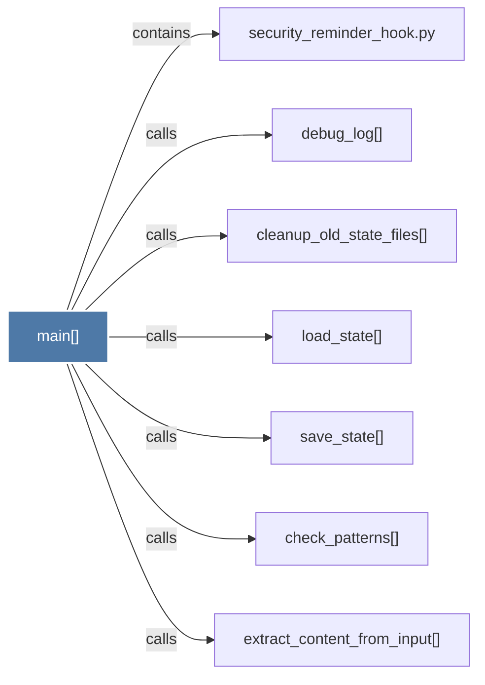

# main()

> [!info] Properties
> **File Type**: code
> **Community**: [[_COMMUNITY_Community None|Community None]]
> **Degree**: 7

## Architecture Graph


## Outbound Connections
- [[check_patterns()]] - `calls` [EXTRACTED]
- [[cleanup_old_state_files()]] - `calls` [EXTRACTED]
- [[debug_log()]] - `calls` [EXTRACTED]
- [[extract_content_from_input()]] - `calls` [EXTRACTED]
- [[load_state()]] - `calls` [EXTRACTED]
- [[save_state()]] - `calls` [EXTRACTED]
- [[security_reminder_hook.py]] - `contains` [EXTRACTED]

## Inbound Dependencies
> [!abstract]- Files that link here
```dataview
LIST
FROM [[main()_8]]
```

#graphify/code #graphify/EXTRACTED #community/Community_None