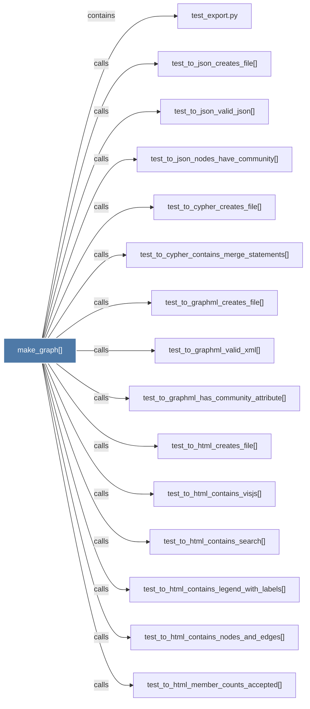

# make_graph()

> [!info] Properties
> **File Type**: code
> **Community**: [[_COMMUNITY_Community None|Community None]]
> **Degree**: 16

## Architecture Graph


## Outbound Connections
- [[test_export.py]] - `contains` [EXTRACTED]
- [[test_to_canvas_file_paths_relative_to_vault()]] - `calls` [EXTRACTED]
- [[test_to_cypher_contains_merge_statements()]] - `calls` [EXTRACTED]
- [[test_to_cypher_creates_file()]] - `calls` [EXTRACTED]
- [[test_to_graphml_creates_file()]] - `calls` [EXTRACTED]
- [[test_to_graphml_has_community_attribute()]] - `calls` [EXTRACTED]
- [[test_to_graphml_valid_xml()]] - `calls` [EXTRACTED]
- [[test_to_html_contains_legend_with_labels()]] - `calls` [EXTRACTED]
- [[test_to_html_contains_nodes_and_edges()]] - `calls` [EXTRACTED]
- [[test_to_html_contains_search()]] - `calls` [EXTRACTED]
- [[test_to_html_contains_visjs()]] - `calls` [EXTRACTED]
- [[test_to_html_creates_file()]] - `calls` [EXTRACTED]
- [[test_to_html_member_counts_accepted()]] - `calls` [EXTRACTED]
- [[test_to_json_creates_file()]] - `calls` [EXTRACTED]
- [[test_to_json_nodes_have_community()]] - `calls` [EXTRACTED]
- [[test_to_json_valid_json()]] - `calls` [EXTRACTED]

## Inbound Dependencies
> [!abstract]- Files that link here
```dataview
LIST
FROM [[make_graph()]]
```

#graphify/code #graphify/EXTRACTED #community/Community_None