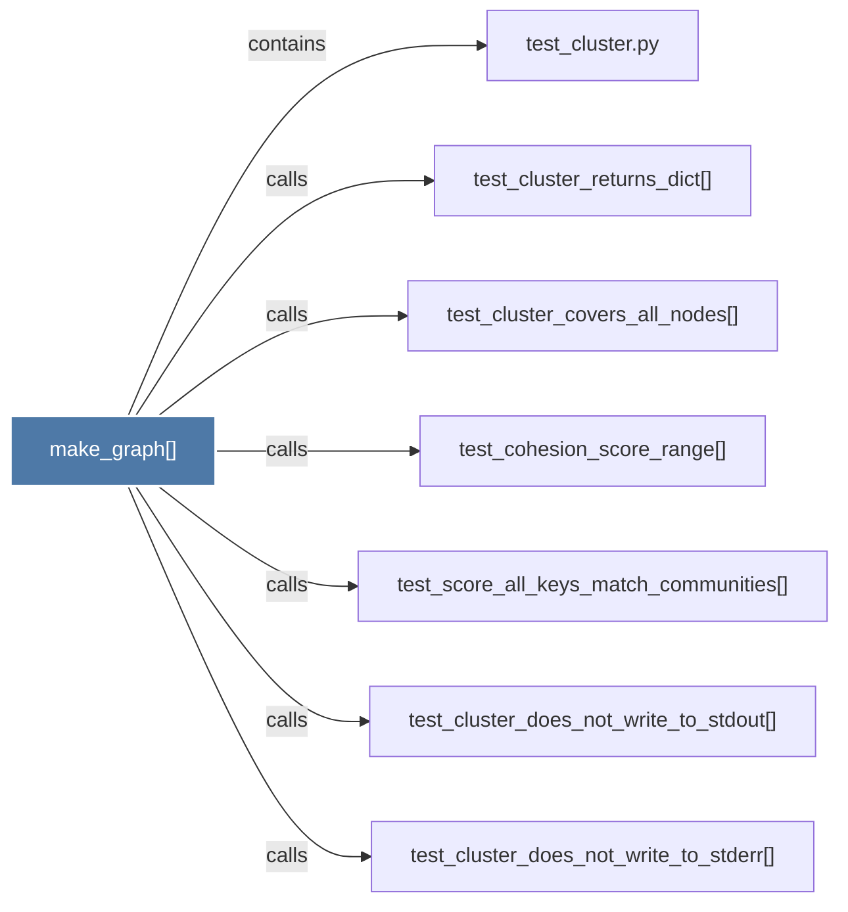

# make_graph()

> [!info] Properties
> **File Type**: code
> **Community**: [[_COMMUNITY_Community None|Community None]]
> **Degree**: 7

## Architecture Graph


## Outbound Connections
- [[test_cluster.py]] - `contains` [EXTRACTED]
- [[test_cluster_covers_all_nodes()]] - `calls` [EXTRACTED]
- [[test_cluster_does_not_write_to_stderr()]] - `calls` [EXTRACTED]
- [[test_cluster_does_not_write_to_stdout()]] - `calls` [EXTRACTED]
- [[test_cluster_returns_dict()]] - `calls` [EXTRACTED]
- [[test_cohesion_score_range()]] - `calls` [EXTRACTED]
- [[test_score_all_keys_match_communities()]] - `calls` [EXTRACTED]

## Inbound Dependencies
> [!abstract]- Files that link here
```dataview
LIST
FROM [[make_graph()_1]]
```

#graphify/code #graphify/EXTRACTED #community/Community_None