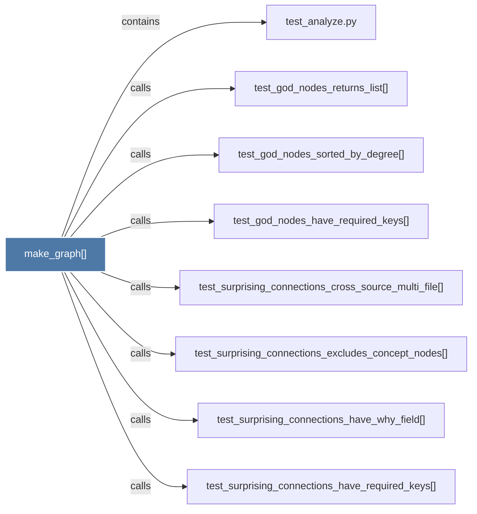

# make_graph()

> [!info] Properties
> **File Type**: code
> **Community**: [[_COMMUNITY_Community None|Community None]]
> **Degree**: 8

## Architecture Graph


## Outbound Connections
- [[test_analyze.py]] - `contains` [EXTRACTED]
- [[test_god_nodes_have_required_keys()]] - `calls` [EXTRACTED]
- [[test_god_nodes_returns_list()]] - `calls` [EXTRACTED]
- [[test_god_nodes_sorted_by_degree()]] - `calls` [EXTRACTED]
- [[test_surprising_connections_cross_source_multi_file()]] - `calls` [EXTRACTED]
- [[test_surprising_connections_excludes_concept_nodes()]] - `calls` [EXTRACTED]
- [[test_surprising_connections_have_required_keys()]] - `calls` [EXTRACTED]
- [[test_surprising_connections_have_why_field()]] - `calls` [EXTRACTED]

## Inbound Dependencies
> [!abstract]- Files that link here
```dataview
LIST
FROM [[make_graph()_2]]
```

#graphify/code #graphify/EXTRACTED #community/Community_None