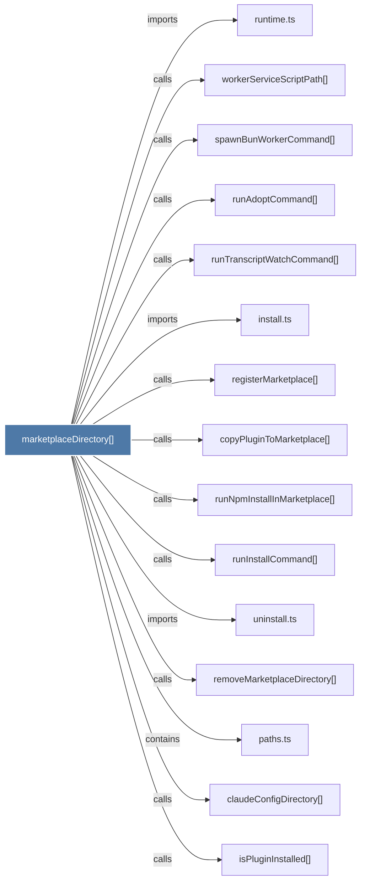

# marketplaceDirectory()

> [!info] Properties
> **File Type**: code
> **Community**: [[_COMMUNITY_Community None|Community None]]
> **Degree**: 15

## Architecture Graph


## Outbound Connections
- [[claudeConfigDirectory()]] - `calls` [EXTRACTED]
- [[copyPluginToMarketplace()]] - `calls` [INFERRED]
- [[install.ts]] - `imports` [EXTRACTED]
- [[isPluginInstalled()]] - `calls` [EXTRACTED]
- [[paths.ts_1]] - `contains` [EXTRACTED]
- [[registerMarketplace()]] - `calls` [INFERRED]
- [[removeMarketplaceDirectory()]] - `calls` [INFERRED]
- [[runAdoptCommand()]] - `calls` [INFERRED]
- [[runInstallCommand()]] - `calls` [INFERRED]
- [[runNpmInstallInMarketplace()]] - `calls` [INFERRED]
- [[runTranscriptWatchCommand()]] - `calls` [INFERRED]
- [[runtime.ts]] - `imports` [EXTRACTED]
- [[spawnBunWorkerCommand()]] - `calls` [INFERRED]
- [[uninstall.ts]] - `imports` [EXTRACTED]
- [[workerServiceScriptPath()]] - `calls` [INFERRED]

## Inbound Dependencies
> [!abstract]- Files that link here
```dataview
LIST
FROM [[marketplaceDirectory()]]
```

#graphify/code #graphify/INFERRED #community/Community_None