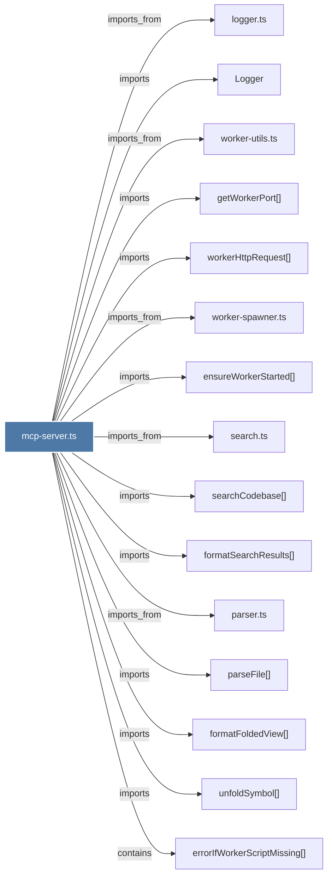

# mcp-server.ts

> [!info] Properties
> **File Type**: code
> **Community**: [[_COMMUNITY_Community None|Community None]]
> **Degree**: 28

## Architecture Graph


## Outbound Connections
- [[Logger]] - `imports` [EXTRACTED]
- [[attachStdioLifecycle()]] - `contains` [EXTRACTED]
- [[callWorkerAPI()]] - `contains` [EXTRACTED]
- [[callWorkerAPIPost()]] - `contains` [EXTRACTED]
- [[checkMarketplaceMarker()]] - `contains` [EXTRACTED]
- [[cleanup()_2]] - `contains` [EXTRACTED]
- [[detachStdioLifecycle()]] - `contains` [EXTRACTED]
- [[ensureWorkerConnection()]] - `contains` [EXTRACTED]
- [[ensureWorkerStarted()]] - `imports` [EXTRACTED]
- [[errorIfWorkerScriptMissing()]] - `contains` [EXTRACTED]
- [[executeWorkerPostRequest()]] - `contains` [EXTRACTED]
- [[formatFoldedView()]] - `imports` [EXTRACTED]
- [[formatSearchResults()]] - `imports` [EXTRACTED]
- [[getWorkerPort()]] - `imports` [EXTRACTED]
- [[handleStdioClosed()]] - `contains` [EXTRACTED]
- [[handleStdioError()]] - `contains` [EXTRACTED]
- [[logger.ts]] - `imports_from` [EXTRACTED]
- [[main()_20]] - `contains` [EXTRACTED]
- [[parseFile()]] - `imports` [EXTRACTED]
- [[parser.ts_1]] - `imports_from` [EXTRACTED]
- [[search.ts]] - `imports_from` [EXTRACTED]
- [[searchCodebase()]] - `imports` [EXTRACTED]
- [[startParentHeartbeat()]] - `contains` [EXTRACTED]
- [[unfoldSymbol()]] - `imports` [EXTRACTED]
- [[verifyWorkerConnection()]] - `contains` [EXTRACTED]
- [[worker-spawner.ts]] - `imports_from` [EXTRACTED]
- [[worker-utils.ts]] - `imports_from` [EXTRACTED]
- [[workerHttpRequest()]] - `imports` [EXTRACTED]

## Inbound Dependencies
> [!abstract]- Files that link here
```dataview
LIST
FROM [[mcp-server.ts]]
```

#graphify/code #graphify/EXTRACTED #community/Community_None