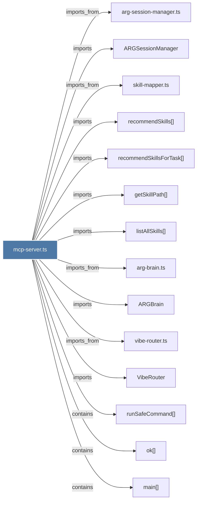

# mcp-server.ts

> [!info] Properties
> **File Type**: code
> **Community**: [[_COMMUNITY_Community None|Community None]]
> **Degree**: 14

## Architecture Graph


## Outbound Connections
- [[ARGBrain]] - `imports` [EXTRACTED]
- [[ARGSessionManager]] - `imports` [EXTRACTED]
- [[VibeRouter]] - `imports` [EXTRACTED]
- [[arg-brain.ts]] - `imports_from` [EXTRACTED]
- [[arg-session-manager.ts]] - `imports_from` [EXTRACTED]
- [[getSkillPath()]] - `imports` [EXTRACTED]
- [[listAllSkills()]] - `imports` [EXTRACTED]
- [[main()_44]] - `contains` [EXTRACTED]
- [[ok()]] - `contains` [EXTRACTED]
- [[recommendSkills()]] - `imports` [EXTRACTED]
- [[recommendSkillsForTask()]] - `imports` [EXTRACTED]
- [[runSafeCommand()]] - `contains` [EXTRACTED]
- [[skill-mapper.ts]] - `imports_from` [EXTRACTED]
- [[vibe-router.ts]] - `imports_from` [EXTRACTED]

## Inbound Dependencies
> [!abstract]- Files that link here
```dataview
LIST
FROM [[mcp-server.ts_1]]
```

#graphify/code #graphify/EXTRACTED #community/Community_None