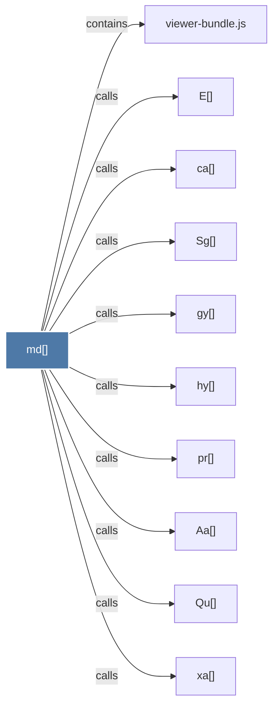

# md()

> [!info] Properties
> **File Type**: code
> **Community**: [[_COMMUNITY_Community None|Community None]]
> **Degree**: 10

## Architecture Graph


## Outbound Connections
- [[Aa()]] - `calls` [EXTRACTED]
- [[E()]] - `calls` [EXTRACTED]
- [[Qu()]] - `calls` [EXTRACTED]
- [[Sg()]] - `calls` [EXTRACTED]
- [[ca()]] - `calls` [EXTRACTED]
- [[gy()]] - `calls` [EXTRACTED]
- [[hy()]] - `calls` [EXTRACTED]
- [[pr()]] - `calls` [EXTRACTED]
- [[viewer-bundle.js]] - `contains` [EXTRACTED]
- [[xa()]] - `calls` [EXTRACTED]

## Inbound Dependencies
> [!abstract]- Files that link here
```dataview
LIST
FROM [[md()]]
```

#graphify/code #graphify/EXTRACTED #community/Community_None