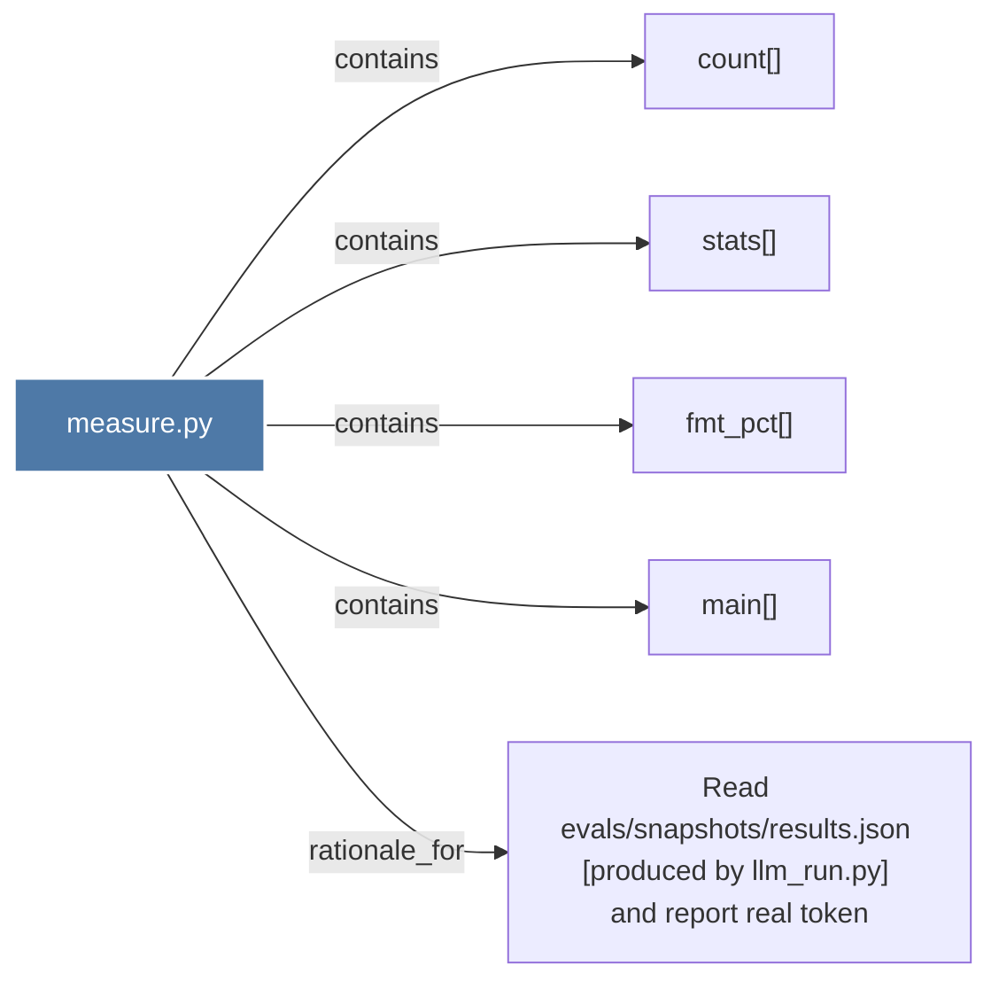

# measure.py

> [!info] Properties
> **File Type**: code
> **Community**: [[_COMMUNITY_Community None|Community None]]
> **Degree**: 5

## Architecture Graph


## Outbound Connections
- [[Read evalssnapshotsresults.json (produced by llm_run.py) and report real token]] - `rationale_for` [EXTRACTED]
- [[count()_1]] - `contains` [EXTRACTED]
- [[fmt_pct()]] - `contains` [EXTRACTED]
- [[main()_16]] - `contains` [EXTRACTED]
- [[stats()]] - `contains` [EXTRACTED]

## Inbound Dependencies
> [!abstract]- Files that link here
```dataview
LIST
FROM [[measure.py]]
```

#graphify/code #graphify/EXTRACTED #community/Community_None