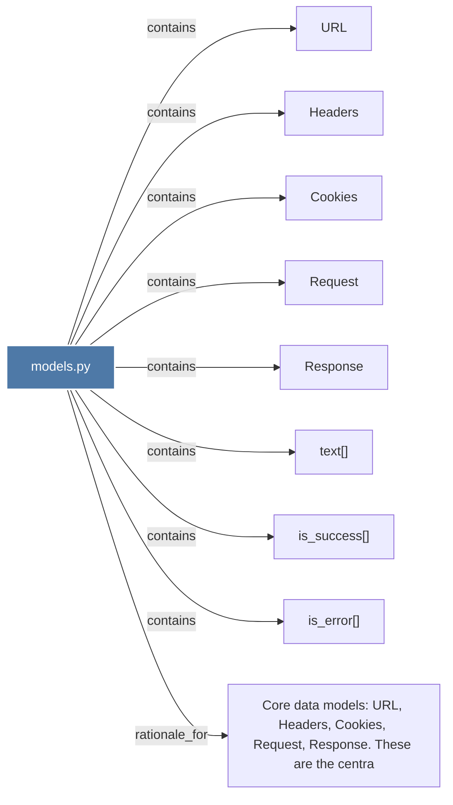

# models.py

> [!info] Properties
> **File Type**: code
> **Community**: [[_COMMUNITY_Community None|Community None]]
> **Degree**: 9

## Architecture Graph


## Outbound Connections
- [[Cookies]] - `contains` [EXTRACTED]
- [[Core data models URL, Headers, Cookies, Request, Response. These are the centra]] - `rationale_for` [EXTRACTED]
- [[Headers]] - `contains` [EXTRACTED]
- [[Request]] - `contains` [EXTRACTED]
- [[Response]] - `contains` [EXTRACTED]
- [[URL]] - `contains` [EXTRACTED]
- [[is_error()]] - `contains` [EXTRACTED]
- [[is_success()]] - `contains` [EXTRACTED]
- [[text()]] - `contains` [EXTRACTED]

## Inbound Dependencies
> [!abstract]- Files that link here
```dataview
LIST
FROM [[models.py]]
```

#graphify/code #graphify/EXTRACTED #community/Community_None