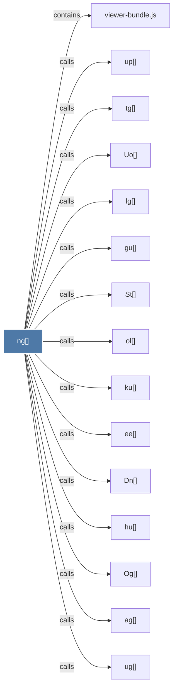

# ng()

> [!info] Properties
> **File Type**: code
> **Community**: [[_COMMUNITY_Community None|Community None]]
> **Degree**: 19

## Architecture Graph


## Outbound Connections
- [[Dn()]] - `calls` [EXTRACTED]
- [[Og()]] - `calls` [EXTRACTED]
- [[St()]] - `calls` [EXTRACTED]
- [[Uo()]] - `calls` [EXTRACTED]
- [[Uy()]] - `calls` [EXTRACTED]
- [[ag()]] - `calls` [EXTRACTED]
- [[cy()]] - `calls` [EXTRACTED]
- [[ee()]] - `calls` [EXTRACTED]
- [[gu()]] - `calls` [EXTRACTED]
- [[hu()]] - `calls` [EXTRACTED]
- [[ig()]] - `calls` [EXTRACTED]
- [[ku()]] - `calls` [EXTRACTED]
- [[lg()]] - `calls` [EXTRACTED]
- [[ol()]] - `calls` [EXTRACTED]
- [[sl()]] - `calls` [EXTRACTED]
- [[tg()]] - `calls` [EXTRACTED]
- [[ug()]] - `calls` [EXTRACTED]
- [[up()]] - `calls` [EXTRACTED]
- [[viewer-bundle.js]] - `contains` [EXTRACTED]

## Inbound Dependencies
> [!abstract]- Files that link here
```dataview
LIST
FROM [[ng()]]
```

#graphify/code #graphify/EXTRACTED #community/Community_None