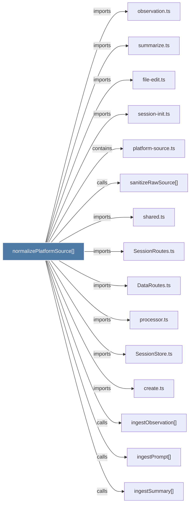

# normalizePlatformSource()

> [!info] Properties
> **File Type**: code
> **Community**: [[_COMMUNITY_Community None|Community None]]
> **Degree**: 24

## Architecture Graph


## Outbound Connections
- [[.createSDKSession()]] - `calls` [INFERRED]
- [[.getAllProjects()]] - `calls` [INFERRED]
- [[.getOrCreateSession()]] - `calls` [INFERRED]
- [[.getProjectCatalog()]] - `calls` [INFERRED]
- [[.importSdkSession()]] - `calls` [INFERRED]
- [[.parsePaginationParams()]] - `calls` [INFERRED]
- [[DataRoutes.ts]] - `imports` [EXTRACTED]
- [[SessionRoutes.ts]] - `imports` [EXTRACTED]
- [[SessionStore.ts]] - `imports` [EXTRACTED]
- [[create.ts]] - `imports` [EXTRACTED]
- [[createSDKSession()]] - `calls` [INFERRED]
- [[file-edit.ts]] - `imports` [EXTRACTED]
- [[ingestObservation()]] - `calls` [INFERRED]
- [[ingestPrompt()]] - `calls` [INFERRED]
- [[ingestSummary()]] - `calls` [INFERRED]
- [[observation.ts]] - `imports` [EXTRACTED]
- [[platform-source.ts]] - `contains` [EXTRACTED]
- [[processor.ts]] - `imports` [EXTRACTED]
- [[resolveCreateSessionArgs()]] - `calls` [INFERRED]
- [[resolveCreateSessionArgs()_1]] - `calls` [INFERRED]
- [[sanitizeRawSource()]] - `calls` [EXTRACTED]
- [[session-init.ts]] - `imports` [EXTRACTED]
- [[shared.ts]] - `imports` [EXTRACTED]
- [[summarize.ts]] - `imports` [EXTRACTED]

## Inbound Dependencies
> [!abstract]- Files that link here
```dataview
LIST
FROM [[normalizePlatformSource()]]
```

#graphify/code #graphify/EXTRACTED #community/Community_None