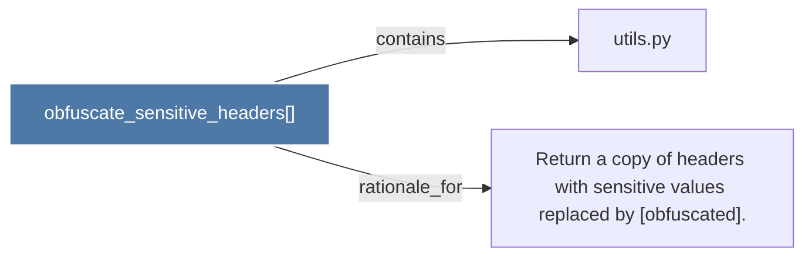

# obfuscate_sensitive_headers()

> [!info] Properties
> **File Type**: code
> **Community**: [[_COMMUNITY_Community None|Community None]]
> **Degree**: 2

## Architecture Graph


## Outbound Connections
- [[Return a copy of headers with sensitive values replaced by obfuscated.]] - `rationale_for` [EXTRACTED]
- [[utils.py]] - `contains` [EXTRACTED]

## Inbound Dependencies
> [!abstract]- Files that link here
```dataview
LIST
FROM [[obfuscate_sensitive_headers()]]
```

#graphify/code #graphify/EXTRACTED #community/Community_None