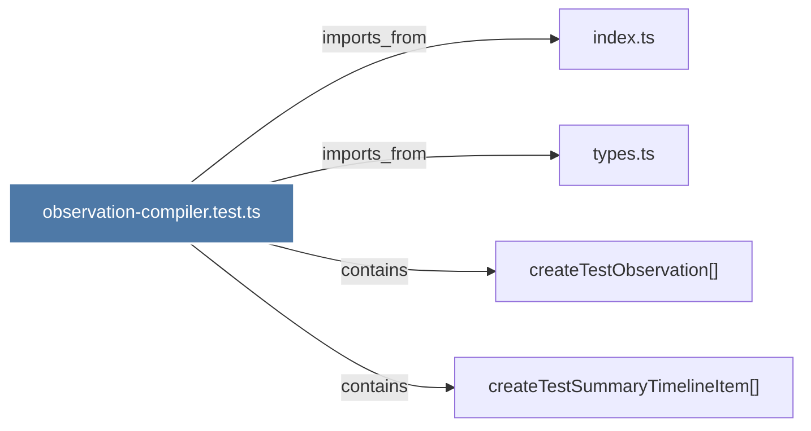

# observation-compiler.test.ts

> [!info] Properties
> **File Type**: code
> **Community**: [[_COMMUNITY_Community None|Community None]]
> **Degree**: 4

## Architecture Graph


## Outbound Connections
- [[createTestObservation()]] - `contains` [EXTRACTED]
- [[createTestSummaryTimelineItem()]] - `contains` [EXTRACTED]
- [[index.ts_10]] - `imports_from` [EXTRACTED]
- [[types.ts_12]] - `imports_from` [EXTRACTED]

## Inbound Dependencies
> [!abstract]- Files that link here
```dataview
LIST
FROM [[observation-compiler.test.ts]]
```

#graphify/code #graphify/EXTRACTED #community/Community_None