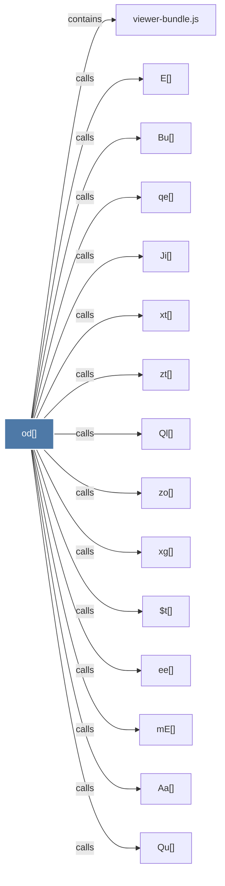

# od()

> [!info] Properties
> **File Type**: code
> **Community**: [[_COMMUNITY_Community None|Community None]]
> **Degree**: 20

## Architecture Graph


## Outbound Connections
- [[$t()]] - `calls` [EXTRACTED]
- [[Aa()]] - `calls` [EXTRACTED]
- [[Bu()]] - `calls` [EXTRACTED]
- [[E()]] - `calls` [EXTRACTED]
- [[Ji()]] - `calls` [EXTRACTED]
- [[Ql()]] - `calls` [EXTRACTED]
- [[Qu()]] - `calls` [EXTRACTED]
- [[Xs()]] - `calls` [EXTRACTED]
- [[Zu()]] - `calls` [EXTRACTED]
- [[ee()]] - `calls` [EXTRACTED]
- [[ks()]] - `calls` [EXTRACTED]
- [[m0()]] - `calls` [EXTRACTED]
- [[mE()]] - `calls` [EXTRACTED]
- [[qe()]] - `calls` [EXTRACTED]
- [[viewer-bundle.js]] - `contains` [EXTRACTED]
- [[xa()]] - `calls` [EXTRACTED]
- [[xg()]] - `calls` [EXTRACTED]
- [[xt()]] - `calls` [EXTRACTED]
- [[zo()]] - `calls` [EXTRACTED]
- [[zt()]] - `calls` [EXTRACTED]

## Inbound Dependencies
> [!abstract]- Files that link here
```dataview
LIST
FROM [[od()]]
```

#graphify/code #graphify/EXTRACTED #community/Community_None