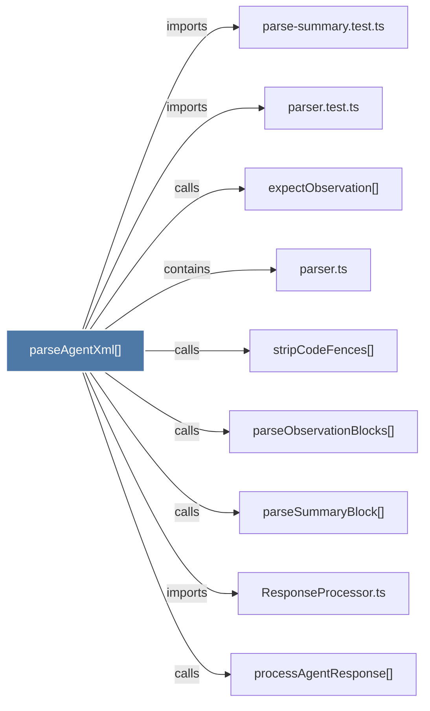

# parseAgentXml()

> [!info] Properties
> **File Type**: code
> **Community**: [[_COMMUNITY_Community None|Community None]]
> **Degree**: 9

## Architecture Graph


## Outbound Connections
- [[ResponseProcessor.ts]] - `imports` [EXTRACTED]
- [[expectObservation()]] - `calls` [INFERRED]
- [[parse-summary.test.ts]] - `imports` [EXTRACTED]
- [[parseObservationBlocks()]] - `calls` [EXTRACTED]
- [[parseSummaryBlock()]] - `calls` [EXTRACTED]
- [[parser.test.ts]] - `imports` [EXTRACTED]
- [[parser.ts]] - `contains` [EXTRACTED]
- [[processAgentResponse()]] - `calls` [INFERRED]
- [[stripCodeFences()]] - `calls` [EXTRACTED]

## Inbound Dependencies
> [!abstract]- Files that link here
```dataview
LIST
FROM [[parseAgentXml()]]
```

#graphify/code #graphify/EXTRACTED #community/Community_None