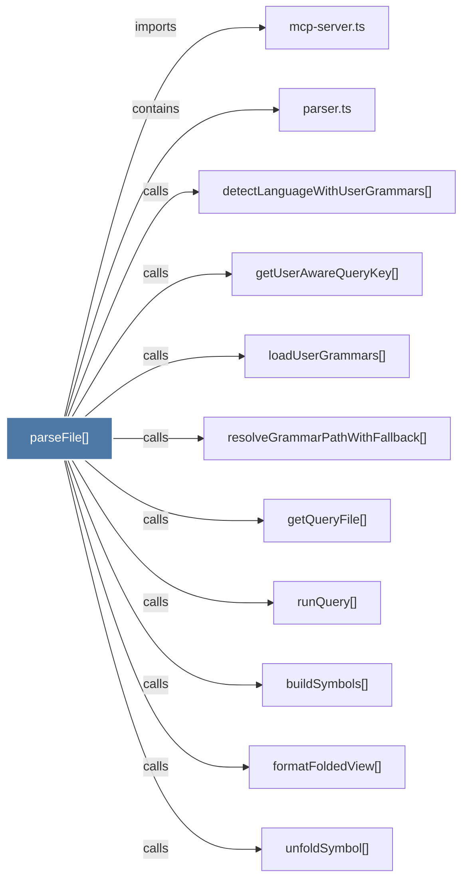

# parseFile()

> [!info] Properties
> **File Type**: code
> **Community**: [[_COMMUNITY_Community None|Community None]]
> **Degree**: 11

## Architecture Graph


## Outbound Connections
- [[buildSymbols()]] - `calls` [EXTRACTED]
- [[detectLanguageWithUserGrammars()]] - `calls` [EXTRACTED]
- [[formatFoldedView()]] - `calls` [EXTRACTED]
- [[getQueryFile()]] - `calls` [EXTRACTED]
- [[getUserAwareQueryKey()]] - `calls` [EXTRACTED]
- [[loadUserGrammars()]] - `calls` [EXTRACTED]
- [[mcp-server.ts]] - `imports` [EXTRACTED]
- [[parser.ts_1]] - `contains` [EXTRACTED]
- [[resolveGrammarPathWithFallback()]] - `calls` [EXTRACTED]
- [[runQuery()]] - `calls` [EXTRACTED]
- [[unfoldSymbol()]] - `calls` [EXTRACTED]

## Inbound Dependencies
> [!abstract]- Files that link here
```dataview
LIST
FROM [[parseFile()]]
```

#graphify/code #graphify/EXTRACTED #community/Community_None