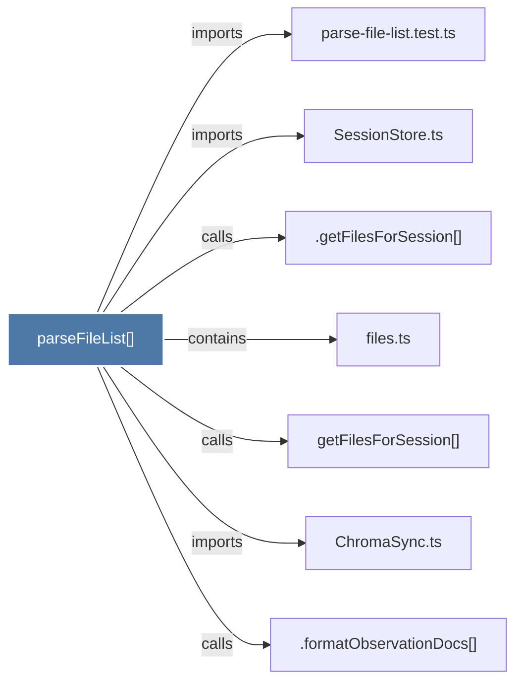

# parseFileList()

> [!info] Properties
> **File Type**: code
> **Community**: [[_COMMUNITY_Community None|Community None]]
> **Degree**: 7

## Architecture Graph


## Outbound Connections
- [[.formatObservationDocs()]] - `calls` [INFERRED]
- [[.getFilesForSession()]] - `calls` [INFERRED]
- [[ChromaSync.ts]] - `imports` [EXTRACTED]
- [[SessionStore.ts]] - `imports` [EXTRACTED]
- [[files.ts]] - `contains` [EXTRACTED]
- [[getFilesForSession()]] - `calls` [EXTRACTED]
- [[parse-file-list.test.ts]] - `imports` [EXTRACTED]

## Inbound Dependencies
> [!abstract]- Files that link here
```dataview
LIST
FROM [[parseFileList()]]
```

#graphify/code #graphify/EXTRACTED #community/Community_None