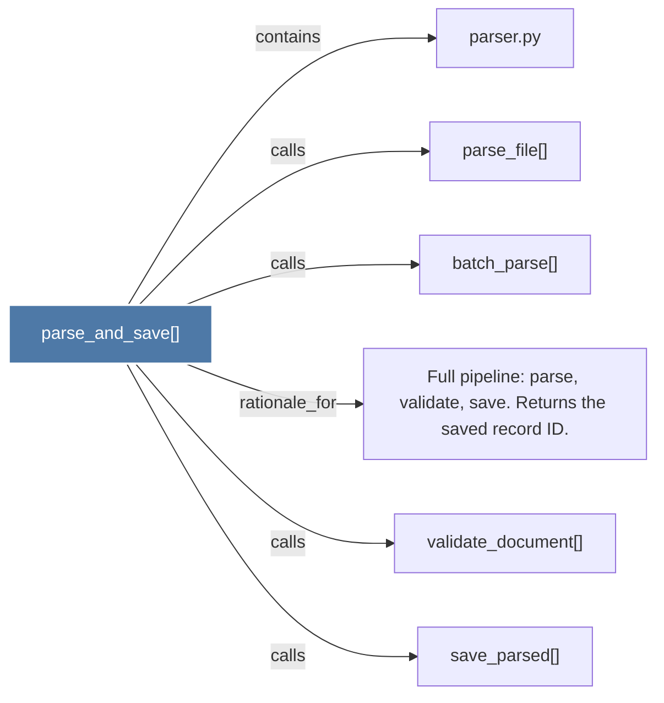

# parse_and_save()

> [!info] Properties
> **File Type**: code
> **Community**: [[_COMMUNITY_Community None|Community None]]
> **Degree**: 6

## Architecture Graph


## Outbound Connections
- [[Full pipeline parse, validate, save. Returns the saved record ID.]] - `rationale_for` [EXTRACTED]
- [[batch_parse()]] - `calls` [EXTRACTED]
- [[parse_file()]] - `calls` [EXTRACTED]
- [[parser.py]] - `contains` [EXTRACTED]
- [[save_parsed()]] - `calls` [INFERRED]
- [[validate_document()]] - `calls` [INFERRED]

## Inbound Dependencies
> [!abstract]- Files that link here
```dataview
LIST
FROM [[parse_and_save()]]
```

#graphify/code #graphify/EXTRACTED #community/Community_None